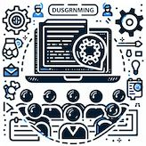
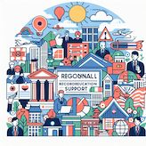

# 私たちについて

  

はじめまして。昼間はプログラマーとして働いていますが、開業志望があり独立を目指しています。サラリーマンとして企業に就職して、事業の移り変わりに合わせる形で、これまで ITプロデューサ / セールスエンジニア / ITコンサルタント / プロジェクトマネージャ(PM) / プロダクトマネージャ(PdM) / システムエンジニア(SE) などさまざまな職種を経験してきました。 東京に住み、ずずという名前のかわいい猫を飼っています。好きなものはトリッパ、そして通り雨に濡れること。

金沢プログラミングサロンは2025年からの創立を目指し、IT人材の育成に支援する教育コンテンツをご提供していく予定です。金沢に所在し地域に根付いてコミュニティへ貢献していきます。

## 基本理念

- 人格の形成
    - 個人の自主性と成長を尊重し、事業を通して人格を形成する
    - 短期的な利益を最重要視せず、誠実で正直に、倫理にかなった事業を行う
- 社会へ貢献
    - 社会に貢献するため、課題を解決できるアイデアを提供する
    - 最先端の技術に対して好奇心を持って、パイオニアになる領域を見つける
- 時間の投資
    - 顧客に満足してもらうために時間を使うことを常に考える
    - 生産性をより高められるかを基準に判断して、そのためにやらないことを決める

私たちが目指すのは、
未来を担うITエンジニアを地域で育成することです。
私たちは、社会に貢献するプロフェッショナルを育成することに情熱を燃やしています。

最新の技術トレンドから、キャリアのアドバイスまで、あなたの成長をサポートします。

一歩踏み出して、未来への道を共に歩みましょう。

## 事業内容
地域に根付いたIT課題の解決

{ align=left }
### プログラミング教材作成
事業にITを導入しようとする人が効率よくスキルを習得できる教材を開発します

   

{ align=left }
### プログラミング教室
教室でのオンサイト型講義で、受講者同士でモチベーションを高め合いたい人向けに、プログラミング教室を開講します

   

{ align=left }

### ホームページおよびLP作成
企業のホームページや製品プロモーションのためのランディングページの受託開発を行います

   

{ align=left }

### 地域復興支援
被災地への復興支援活動を行います