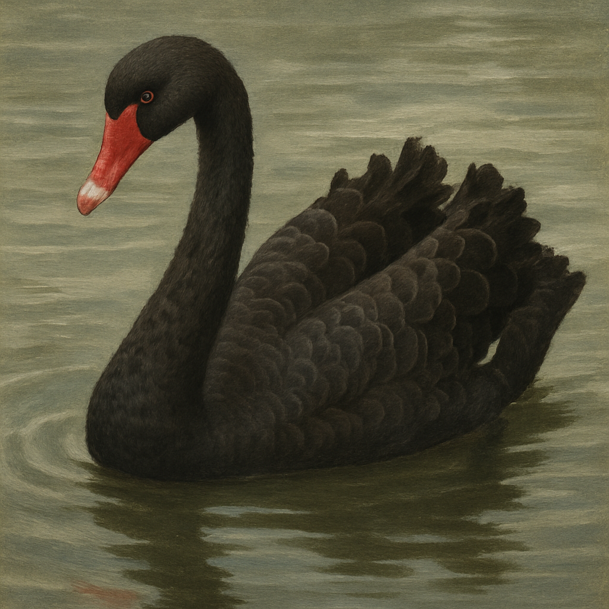

この本を読もうと思ったきっかけは、どこか別の書籍でAmazon.comの共同創設者のジェフ・ベゾスが考え方に影響を受けていると書かれているのを見たからだ。

“ブラックスワン”は、ニューヨーク大学のファイナンス学教授であるナシム・ニコラス・タレブによって書かれた書籍です。この本は、予測できないイベントや偶発的な出来事がどれほど影響を与えるかに焦点を当てています。タレブは、このような出来事を「ブラックスワン」と呼び、これらの要因が社会、経済、歴史の中でどのように影響を及ぼすかを調査しています。

この本は、予測不可能な要因がビジネスや個人の成功に与える影響を探求する点で非常に興味深いものです。タレブは、私たちが日常的に直面するリスクや不確実性に対処する方法について、洞察を提供しています。また、過度に確信的で予測可能なモデルがどれほど危険であるかを警告し、これらのモデルが実際の世界での不確実性を無視していることを示しています。

“ブラックスワン”は、予測可能性についての従来のアプローチを疑問視し、読者に新しい視点を提供します。タレブの洞察は非常に深いものであり、ビジネスリーダーや意思決定者だけでなく、一般の読者にも示唆に富んだ内容です。彼の警告と提案は、私たちが不確実性を受け入れ、それに対処する方法を再考するきっかけとなるでしょう。

## プラトン性

「プラトン性」という言葉は、通常、哲学的な文脈で使用されます。プラトン性は、古代ギリシャの哲学者プラトンの考え方に由来しており、物事の本質的な形や理想形を指すことがあります。

具体的には、プラトン性は以下のような状況で使われることがあります：

1. 理想や理念の表現：例えば、「彼の行動はプラトン性を反映している」というように、その人の行動が理想的な形や理念に忠実であることを表現する場合に使われます。
1. 理想的な形態や規範：ある物事が理想的な状態や形態に近いときに、「それはプラトン性に近い」と表現されることがあります。
1. 現実と理想の対比：プラトン性はしばしば現実世界と対比され、理想的な世界や理念として捉えられることがあります。

!!! quote "17 プロローグ"
    人間は地図と本物の地面と取り違え、純粋で扱いやすい「型」にばかり頂点を当てる傾向がある。

## 不透明の三つ子

!!! quote "37 第１章 実証的会議主義者への道"

    a わかったという幻想。世界は実感するよりずっと複雑（あるいはランダム）なのに、みんな何が起こっているかを自分にはわかっていると思い込んでいる。

    b 振り返った時の歪み。わたしたちは、バックミラーを見るみたいにして、後付けで物事を解釈する（歴史は、人が経験する現実よりも、歴史の本で読んだ方が分かりやすい）。

    c 実際に起こったことに関する情報を過大評価する。権威と学識のある人は不自由になる。特に物事の分類を始めたりすると、つまり「プラトン化」すると、それに縛られてしまう。

## レバノンの戦争

レバノンの戦争とは、通常、レバノン内戦（1975年-1990年）を指します。この内戦は、レバノンの政治、宗教、民族間の緊張、複雑な地域的および国際的な影響によって引き起こされました。

内戦の原因は複雑で、異なる宗派間の緊張、政治的な不安定さ、パレスチナ難民問題、外国の軍事介入などが複合的に影響しています。内戦は、多くの民間人の死傷者や大規模な破壊をもたらし、国家の統合を深刻に傷つけました。

内戦の主な対立勢力には、キリスト教系のファランジスト、イスラム教系のアムル派、パレスチナ解放機構（PLO）、シリア、イスラエルなどがありました。内戦は、外国の介入や多くの犠牲者を伴う長期間にわたって続き、1990年のタ・イフ合意によって一時的に終結しました。

レバノン内戦は、レバノンの歴史における重要な出来事であり、その影響は今もなお感じられています。

## 1987年の暴落

1987年の暴落は、通常、「ブラックマンデー」として知られています。これは、1987年10月19日に起きた世界的な株価急落を指します。この暴落は、アメリカ合衆国を中心に世界各国の株式市場で大きな影響を与えました。

ブラックマンデーの原因は複数ありますが、主な要因の一つは、先進国の金融政策による金融バブルの拡大と、それに伴う株価の急上昇でした。1980年代には、アメリカやイギリスなどの主要国で株式市場が急速に成長し、多くの投資家が株式市場に資金を投入していました。

また、コンピューターの自動取引システムやプログラム取引が普及し始めており、これが株式市場の急激な変動を助長する要因となりました。投資家のパニックが拡大し、大量の売り注文が発生したことで、株式市場は急速に暴落しました。

ブラックマンデーでは、アメリカのダウ・ジョーンズ工業株価平均は22%以上下落し、世界中の株式市場も大幅に下落しました。この暴落は世界的な経済不安を引き起こし、多くの投資家や金融機関に影響を与えました。

## 投機家と売春婦

!!! quote
    だから、すぐさま（でも間違った）結論にたどり着いた。人間は「アイディア」人間と「仕事」人間に分けられると考えたのだ。アイディア人間は取引や作品の形で頭の産物を売る人、仕事人間は労力を得る人だ。

!!! quote
    ノウハウやアイディアを考えて企画して活用して利益を上げる。発展途上国にある下請けの工場が単純作業を担当し、教養があって算数が好きな国のエンジニアが、創造性のいらない技術的な細かい部分を担当する。

その他本書では、ブラックスワンが起こりやすい環境として、「月並みの国」と「果ての国」という分に特徴がまとめられている。本書で取り上げられる特徴がブラックスワンを認識する上でこの後どう述べられているのか期待し、読み進める。

## 扇情と黒い白鳥

次のように実験がある。被験者は次のシナリオを考えてそれぞれの事象が起こりやすいを推定する。

a. アメリカのどこかで大洪水が起こり、1000人を超える人が亡くなる。

b. カリフォルニアで地震が起こり、それが大洪水を起こして1000人を超える人が亡くなる。

あなたはどちらが起こりやすいと感じるでしょうか？実際、被験者はaよりbの方が起こりにくいと答えるそうです。カリフォルニアでの地震はすぐに想像できる原因で、そこから洪水が起こるしなりをがもっともらしく思えるようで、確率が高いと見積もられます。「のせいで」と一言加えるだけで、物事がそれらしく聞こえるようになる。

## 手っ取り早いやり方

人間の思考の研究ではしばしば、行動の裏にある仕組みを２つに分類して、システム１・システム２や経験的思考と演繹的思考などと呼ぶそうです。システム1とシステム2の思考法は、心理学者のダニエル・カーネマンが提唱した概念です。

*システム1:*

- インスティンクティブな、自動的な思考プロセスを表します。
- 高速で無意識的、ほとんど努力を必要とせずに情報を処理します。
- 直感や感情に基づく意思決定を行います。
- 習慣的な行動やパターンの形成に関与します。
- 例えば、物事の簡単な判断や日常生活での行動はシステム1によって処理されます。

**システム2:**

- 考えごたえのある、意識的で論理的な思考プロセスを表します。
- 遅く、エネルギーを消費するため、努力を必要とします。
- 問題解決や複雑な計算など、注意深い分析に関与します。
- システム1が提供する情報を検証し、必要に応じて補完します。
- 例えば、新しい問題の解決や重要な意思決定は、システム2によって行われます。

この2つのシステムは、日常の様々な活動や判断に影響を与えます。意思決定のプロセスや行動の理解において、重要な枠組みとなっています。

## 私たちには先が見えない

!!! quote
    今日の世界に一番大きな影響を与えた最近の技術を３つ挙げてくれと言うと、だいたいの人はコンピュータ、インターネット、レーザーを上げる。

    （中略）

    これはどれも、黒い白鳥だ。

## 読書後の所感

本書は普段意識しづらい不確実性について書かれたものでした。これまで考えの及ばなかったことを考えることの難しさや、それを表現する文体もなかなか優しいものではなく、個人的にはなかなか頭に入りにくい読みづらさがありました。

読書は、寝起きの早朝や通勤時間や休日のカフェで時間をとりました。少しづつ読み進めると、次に読んだ際に前の内容をあまり覚えておらず前後関係を掴むのに時間がかかって結局よくわからなくなってしまったり、そういった経験から積極的に読書時間を取ろうと言うモチベーションを保つのが難しかったり。結局読了まで3週間かかりました。

例えば、不意に”「キャリブレイト」する”といった動詞の造語が用いられるのですが、いつから出てきた言い回しなのか覚えておらず、その意味を振り返ろうと前ページを探索するのですが、どこかに定義づけられたしょうがあるわけではなく常に文脈として表現されているため、意図を掴めないまま読み進めないといけないといった状況に陥りました。

次はもう一段階具体的な事項について書かれた書籍を読もうと思います。