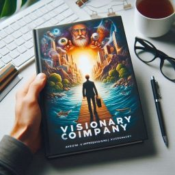

色々な書籍に、本書について記述されていたり、数々の起業家が参考にしているビジネス書の名著として、いつか読みたいと常々思っていたため、今回読み始めようと思う。

シリーズの中でも新しい版であるビジョナリーカンパニーZEROは、現代の若者でも読みやすいかと手にし、実際に内容は理解しやすかったためすでに読了している。その後、企業経営を学べる関連書籍として、”現代の経営”を読み始めたのだが、ドラッガーの内容が私には難しく感じ、読了せずに断念した。その経験があって古典よりの経営書にハードルを感じていた。

先日改めて書店で本書ビジョナリーカンパニーの冒頭数ページを読み、そこまでの難易度を感じなかったため、読む始めることにした。

## ビジョナリーカンパニー 時代を超える生存の原則

ジム・コリンズ著の『ビジョナリー・カンパニー（原題：Built to Last）』は、企業がどのようにして長期的な成功を収めるのか、その秘密を探る名著です。本書は、数十年にわたる徹底的な研究と分析に基づき、卓越した企業が持つ特徴や共通点を明らかにしています。ここでは、その主要なポイントを紹介します。

『ビジョナリー・カンパニー』は、企業が持続的な成功を収めるためのヒントとインスピレーションを与えてくれます。ジム・コリンズは、ビジョナリー企業の共通点を明らかにすることで、他の企業がそれを模倣し、成功するための道筋を示しています。ビジネスリーダーや経営者にとって、本書は必読の一冊です。長期的な視点で企業を成長させたいと考える全ての人にとって、貴重な教訓が詰まっています。

### 卓越した企業の特徴

『ビジョナリー・カンパニー』では、成功を収め続ける企業とそうでない企業の違いを明確に示しています。以下は、ビジョナリー企業に共通する特徴の一部です。

1. 明確なミッションとビジョン
: ビジョナリー企業は、単なる利益追求に留まらず、明確なミッションとビジョンを持っています。これにより、企業全体が一体となり、長期的な目標に向かって進むことができます。

2. コア・バリューの重視
: これらの企業は、自社のコア・バリュー（基本的価値観）を明確にし、それを徹底的に守ります。コア・バリューは、企業文化や経営戦略の基盤となり、全ての意思決定に影響を与えます。

3. 持続的なイノベーション
: ビジョナリー企業は、常に変化と進化を続けることを重視します。イノベーションを促進するための仕組みや文化を持ち、変化を恐れず、新しいアイデアを積極的に取り入れます。

### 事例研究

本書では、ウォルト・ディズニー、3M、メルクなどの企業が取り上げられ、その成功の要因が詳細に分析されています。これらの企業は、いずれも一貫して高いパフォーマンスを維持し、業界のリーダーとして君臨しています。

**ウォルト・ディズニー**
: ウォルト・ディズニーは、創業以来、「家族向けのエンターテインメントを提供する」という明確なビジョンを持ち続けてきました。同社は、映画製作からテーマパーク運営に至るまで、常にイノベーションを追求し、エンターテインメント業界をリードしてきました。

**3M**
: 3Mは、イノベーションと多様性を重視する企業文化を持っています。同社は、社員に対して自由な発想と創造性を奨励し、その結果、多くの革新的な製品が生まれています。ポスト・イットノートやスコッチテープなど、日常生活に欠かせない製品もその一例です。

**十二の崩れた神話**
: 著者が企業に対する調査を行った結果、一般的に考えて偉大なる企業とは何かと推察できそうな神話と、調査結果から分かったビジョナリーカンパニーの実態には、驚くような発見、意外な発見がたくさんあったとのこと。12の内容を読み進めると、なるほどと思うようなことがかかれており、企業を考察する考え方が改まった

!!! quote "第一章　最高のなかの最高"
    神話一

    すばらしい会社をはじめるには、すばらしいアイデアが必要である

## メルク

書籍の中で、メルク（Merck & Co., Inc.）がビジョナリーカンパニーとして取り上げられます。その強力なコア・イデオロギー、挑戦的な目標設定、持続的なイノベーション、強固な企業文化、そして倫理的なビジネス慣行にあります。これらの要素が、メルクを長期的に成功し続ける企業として位置づけています。

**コア・イデオロギー：**
: メルクは、「人々の健康を向上させる」という強い使命感と価値観を持っています。これは、単なる利益追求ではなく、人々の生活の質を向上させることを重視しています。

**BHAG（Big Hairy Audacious Goals）：**
: メルクは、大胆で挑戦的な目標を設定し、それを達成するために努力しています。例えば、新薬の開発やグローバルな健康問題の解決に向けた取り組みなどが挙げられます。

**イノベーションと研究開発：**
: メルクは、持続的なイノベーションと研究開発に大きな投資を行っており、新しい治療法や薬剤の開発に注力しています。これにより、業界のリーダーとしての地位を確立しています。

**企業文化：**
: メルクは、社員が使命感を持ち、価値観を共有する強力な企業文化を育んでいます。この文化が、社員のモチベーションを高め、長期的な成功に寄与しています。

**倫理的なビジネス慣行：**
: メルクは、倫理的なビジネス慣行を重視しており、医薬品業界における高い倫理基準を維持しています。これは、長期的な信頼とブランドの強化に貢献しています。

## ソニー

ソニーは、「クリエイティビティとテクノロジーで世界を驚かせる」という使命を持っています。この使命は、単に製品を販売するだけでなく、人々の生活を豊かにすることを重視しています。

## フォード

フォードは、「人々の生活をより良くするための自動車を提供する」という使命を持っています。この使命は、創業者ヘンリー・フォードによって打ち立てられ、多くの人々に自動車を手の届くものにするというビジョンを持っていました。

## 基本理念

!!! quote "第三章 利益を超えて"
    ビジョナリー・カンパニーを築くには、基本理念を文書にすることが重要である。

    （中略）

    基本理念 = 基本的価値観 + 目的

    基本的価値観 = 組織にとって不可欠で不変の主義。いくつかの一般的な指導原理からなり、文化や経営手法と混同してはならず、利益の追求や目先の事情のために曲げてはならない。

    目的 = 単なる金儲けを超えた会社の近本的な存在理由。地平線の上に永遠に輝き続ける道標となる星であり、個々の目標や事業戦略と混同してはならない。

## BHAG
!!! quote "第五章 社運を賭けた大胆な目標"
    ビジョナリー・カンパニーは進歩を促す仕組みとして、ときとして大胆な目標を掲げる。このような目標を、わたしたちは社運を賭けた大胆な目標（Big Hairy Audacious Goals）の頭文字をとって、BHAGと呼ぶことにした。

## CEO、経営幹部、起業家へのメッセージ

永続的にあり続けるために基本理念を持ったビジョナリー・カンパニーだが、全従業員にとって必ずしも理想的な職場である、と言うわけではないようだ。基本理念におおむね共感して入社する社員はたとえボロ雑巾となろうとも会社に身を捧げることができるが、理念への共感が低い社員は社風とのギャップを感じ周りとの歩幅が合わなくなり、精神面に感じる負担に対して待遇や環境にも不満を抱く。

!!! quote "第六章 カルトのような文化"
    ビジョナリー・カンパニーは自社の理念に基づいて、それを絶えず強化するように一貫したシフナルを送り続ける具体的な仕組みを確立している。以下のような実際的で具体的な方法を使って、従業員を強化し、同質性を追求し、特別な集団に属しているという感覚を作り出している。

## 大量のものを試して、うまくいったものを残す

!!! quote "第七章 大量のものを試して、うまくいったものを残す"
    各社でとくに成功した動きのうちいくつかが、綿密な戦略計画に基づくものではなく、実験、試行錯誤、臨機応変によるものであったり、文字通り、偶然の結果であったりする

書籍には、ビジョナリー・カンパニーとダーウィンの進化論との類似点、3MのCEOの格言、ジョンソン&ジョンソンが偶然によってベビー・パウダーを販売するに至った経緯、機会を活かして空港にサービスに進出したマリオネット、意図しないまま金融サービスと旅行サービスに進出したアメリカン・エキスプレスの例が挙げられている。会社員として日々計画通り業務を遂行することに目が行きがちであるが、永続的な企業の軸となる事業は偶発しているという事実を忘れてはいけない。

!!! quote "第八章 生え抜きの経営陣"
    ビジョナリー・カンパニーを築くと言う観点に立つなら、問題は今の世代で会社をどこまですばらしいものするかだけではない。決定的な点は、次の世代で会社がどうなるか、その次の世代でどうなるか。そのまた次の世代でどうなるかである。

!!! quote "第九章 決して満足しない"
    ビジョナリー・カンパニーになるには、昔ながらの厳しい自制、猛烈な仕事、将来のための絶えざる努力がいやと言うほど必要である。近道はない。魔法の薬はない。抜け道もない。ビジョナリー・カンパニーを築くには、長期間にわたる厳しい仕事が必要である。成功を収めても、それが終点になることはない。

## これは終わりではない

最終章では、本書を読んで著者が知らしめたい教訓として以下の４つの概念を取り上げて、締めている。

!!! quote "第十章 はじまりのおわり"
    1. 時を告げる預言者になるな。時計を作る設計者になれ。
    1. 「ANDの才能」を重視しよう。
    1. 基本理念を維持し、進歩を促す。
    1. 一貫性を追求しよう。

## 読書後の所感

本書を手に取った際に感じた通り、語られる内容は企業経営のことではありますが、読みやすさに関しては全く苦ではありませんでした。3M、HP、メルクといった具体的なビジョナリーカンパニーとそうでない企業の例を取り上げられ、そこから得られる教訓が大変参考になりました。特に、基本理念を作成して醸成していくことの大事さに共感でき、真似して作成しよう思いました。

!!! quote "おわりに"
    自分達の会社をビジョナリー・カンパニーにしたいと考えているが、何からはじめればいいのか

    まず何よりも先に、基本理念をしっかりさせるべきだ。会社の基本的な価値観を箇条書きにするところから出発する。箇条書きにするのは、基本的な価値観でなければならない。項目が五つか六つを超えていれば、基本的な要素まで分析が煮詰まっていない可能性が高い。価値観というからには、時の試練に耐えられるものでなければならない。

今回読書も、早起きした日の起床直後や、通勤時間で読み進め、２週間で読了しました。