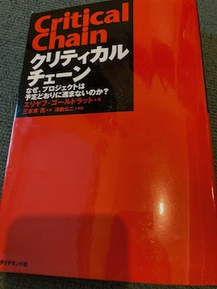
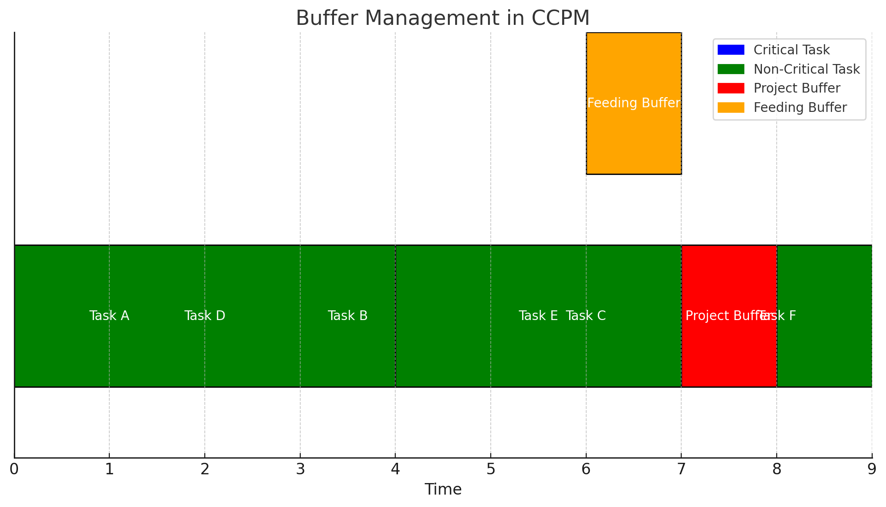

本書についてもどこかで取り上げられているのを見たので、今回読もうと購入しました。エリヤフ・ゴールドラットの「ザ・ゴール」「ザ・ゴール 2 ― 思考プロセス」はすでに読了しています。生産管理プロセス、思考プロセスについてビジネス書としての示唆がありつつ小説形式でストーリーが展開されるため、どんどん読み進められる印象です。第一作のザ・ゴールは初見で目から鱗が落ちましたが、第二作目は真新しいことは少なくなっていき、小説をどんどん読み進めることはできますが、読み終わって何を学ぶべきだったのかいまいちとりつく島がなかった所感もあります。

「クリティカルチェーン」はエリヤフ・ゴールドラット（Eliyahu M. Goldratt）による書籍で、プロジェクト管理に関する独自の手法を紹介しています。この手法は、従来のプロジェクト管理手法に対する問題点を指摘し、効率的なプロジェクト完了を目指すものです。以下はこの書籍の概要と主なポイントです。

## はじめに

### 書籍の紹介

エリヤフ・ゴールドラットによる『クリティカルチェーン』は、プロジェクト管理に関する新たな視点を提供する画期的な書籍です。ゴールドラットは、ビジネス小説形式で、従来のプロジェクト管理手法が抱える問題点を指摘し、それを克服するための方法論「クリティカルチェーンプロジェクトマネジメント（CCPM）」を紹介しています。

本書は、プロジェクト管理者やチームリーダーにとって必読の一冊であり、理論的なフレームワークと実践的なアプローチの両方を提供します。ゴールドラットは、従来のスケジュール見積もりの問題点、リソースの最適化の難しさ、そしてパーキンソンの法則や学生症候群などの現象がプロジェクトの遅延にどのように影響するかを詳細に説明しています。

物語は、架空の製造会社のプロジェクト管理者が、プロジェクトの遅延やコスト超過に悩まされる場面から始まります。主人公は、ゴールドラットの提唱する「クリティカルチェーン」の概念を導入し、次第にプロジェクトの効率と成果を劇的に改善していきます。この過程で、読者はCCPMの基本原理を自然に理解できるように設計されています。

ゴールドラットの前作『ザ・ゴール』と同様に、『クリティカルチェーン』もエンターテイメント性の高い物語を通じて、複雑な理論を分かりやすく解説しています。具体的な例と実践的なアドバイスが豊富に盛り込まれており、理論の応用方法が明確に示されています。

この書籍は、単なる理論書にとどまらず、実際のビジネスシーンでの適用を意識した実践的なガイドブックでもあります。プロジェクト管理の新しい視点を提供する『クリティカルチェーン』は、プロジェクトの成功を目指すすべてのビジネスパーソンにとって貴重なリソースとなるでしょう。

### 著者エリヤフ・ゴールドラットの背景

エリヤフ・ゴールドラット（Eliyahu M. Goldratt）は、イスラエル出身の物理学者、ビジネスコンサルタント、著作家であり、制約理論（Theory of Constraints, TOC）の提唱者として知られています。彼の革新的な思考は、製造業やプロジェクト管理をはじめとする多くの分野に多大な影響を与えてきました。

ゴールドラットは、イスラエルのテルアビブ大学で物理学の博士号を取得し、その後ビジネスの世界に進出しました。彼の最も著名な業績は、1984年に発表された『ザ・ゴール』です。この書籍は、ビジネス小説の形式を取り、工場の生産性向上に関するストーリーを通じて、制約理論を紹介しました。この手法は、従来の管理手法が抱える問題点を指摘し、効率的な改善策を示すもので、多くの企業にとって革命的なものでした。

制約理論（TOC）は、システムのパフォーマンスが特定の制約によって決定されるという考え方に基づいています。ゴールドラットは、この理論を基に、製造プロセス、サプライチェーン管理、プロジェクト管理など、さまざまなビジネス領域に応用可能な実践的なツールと手法を開発しました。TOCは、企業がボトルネックを特定し、リソースを最適化するためのフレームワークとして広く受け入れられています。

『クリティカルチェーン』は、ゴールドラットが制約理論をプロジェクト管理に適用したものであり、プロジェクトが遅延する原因を明らかにし、その解決策を提供することを目的としています。彼のアプローチは、単に理論的な枠組みを提供するだけでなく、具体的な実践方法を示すことで、多くの企業にとって実用的なガイドとなっています。

ゴールドラットの著作と理論は、世界中の企業や教育機関で広く採用されており、ビジネスパフォーマンスの向上に大きく貢献しています。彼の革新的な思考と実践的なアプローチは、現代のビジネスシーンにおいてもなお重要な影響力を持ち続けています。

## クリティカルチェーンの概要

### 書籍の基本コンセプト

『クリティカルチェーン』は、プロジェクト管理の新たな手法として「クリティカルチェーンプロジェクトマネジメント（CCPM）」を提案しています。この手法は、従来のプロジェクト管理の問題点を克服し、プロジェクトを予定通りに進めるための具体的なアプローチを提供します。

CCPMの基本コンセプトは、プロジェクト全体のスケジュールに影響を与える重要なタスクの連鎖、つまり「クリティカルチェーン」に焦点を当てることです。従来のプロジェクト管理手法では、個々のタスクに対して安全余裕を設けることで遅延を防ごうとしますが、これがかえってプロジェクト全体の効率を低下させる原因となることが多いです。CCPMでは、この問題を解決するために、プロジェクト全体のスケジュールにバッファを設けることで、タスクの遅延を吸収し、プロジェクト全体の進行を円滑に保ちます。

### 従来のプロジェクト管理手法との違い

従来のプロジェクト管理手法は、ガントチャートやクリティカルパス法（CPM）を用いてプロジェクトのスケジュールを管理します。これらの手法では、各タスクに対して個別に余裕期間を設けることで、タスクの遅延に備えます。しかし、この方法では、各タスクが余裕期間をすべて消費することが多く、プロジェクト全体の遅延につながりやすいという問題があります。

一方、CCPMでは、各タスクに対して個別に余裕を設けるのではなく、プロジェクト全体のスケジュールに対してバッファを設けます。これにより、各タスクの遅延が発生した場合でも、プロジェクト全体の遅延を防ぐことができます。具体的には、プロジェクトの最後に「プロジェクトバッファ」を設けることで、クリティカルチェーンにおけるタスクの遅延を吸収し、さらに非クリティカルチェーンのタスクに対しても「フィーディングバッファ」や「合流バッファ」を設けることで、全体のスケジュールの安定性を確保します。

## 主要なポイント

### クリティカルチェーンの概念

クリティカルチェーンは、プロジェクト全体のスケジュールに直接影響を与えるタスクの連鎖です。これらのタスクが遅延すると、プロジェクト全体が遅延するため、特に重要です。CCPMでは、クリティカルチェーンに対する管理と監視がプロジェクト成功の鍵となります。

### バッファ管理の重要性

CCPMの中核は、バッファ管理にあります。プロジェクトバッファ、フィーディングバッファ、合流バッファを適切に配置することで、タスクの遅延を吸収し、プロジェクト全体の進行をスムーズに保つことができます。これにより、従来の手法で発生しがちな遅延やコスト超過を防ぐことができます。

### パーキンソンの法則と学生症候群の克服方法

パーキンソンの法則は「仕事は与えられた時間をすべて使い切る」というものです。また、学生症候群は「締め切りが近づくまで仕事を先延ばしにする」という傾向です。CCPMでは、タスクスケジュールに余裕を持たせないことで、これらの現象を防ぎます。バッファはプロジェクト全体に対して設けられるため、各タスクが無駄な余裕期間を持つことがなくなります。

### リソースの最適化

リソースの制約は、プロジェクトの進行に大きな影響を与える要因です。CCPMでは、リソースの最適な配置と利用を図るために「リソースバッファ」を設けます。これにより、リソースの過剰な負荷を防ぎ、プロジェクトの安定性を高めることができます。

## バッファ管理の詳細

### プロジェクトバッファ

プロジェクトバッファは、クリティカルチェーンの終わりに設けられ、全体のスケジュールの遅延に対応します。これにより、クリティカルチェーンにおけるタスクの遅延がプロジェクト全体の遅延に直結しないようにします。

### フィーディングバッファ

フィーディングバッファは、クリティカルチェーンに影響を与える非クリティカルチェーンのタスクに設けられます。これにより、非クリティカルチェーンの遅延がクリティカルチェーンに波及するのを防ぎます。

### 合流バッファ
合流バッファは、複数のタスクが合流するポイントで設けられ、合流するタスクの遅延を吸収します。これにより、合流点でのスケジュールの混乱を防ぎ、プロジェクト全体の進行をスムーズに保ちます。

この図は、CCPM（クリティカルチェーンプロジェクトマネジメント）におけるバッファ管理のシンプルな概要を示しています。

- 青色のタスク: クリティカルチェーンのタスクです。これらのタスクはプロジェクト全体のスケジュールに直接影響を与えます。
- 緑色のタスク: 非クリティカルチェーンのタスクです。これらのタスクはクリティカルチェーンには直接影響を与えませんが、フィーディングバッファを通じて間接的に影響を及ぼします。
- 赤色のバッファ: プロジェクトバッファです。クリティカルチェーンの終わりに置かれ、全体のスケジュールの遅延に対するクッションとして機能します。
- オレンジ色のバッファ: フィーディングバッファです。非クリティカルチェーンのタスクがクリティカルチェーンに影響を与える前に、その遅延を吸収する役割を果たします。

この図により、バッファがどのようにしてプロジェクトの安定性とスケジュールの遵守を支えるかが視覚的に理解できます。

## 実際の適用例

### 成功事例とその効果

『クリティカルチェーン』では、CCPMを実際に導入した企業の成功事例がいくつか紹介されています。これらの事例は、理論が現実のビジネス環境でどのように適用され、どのような効果をもたらしたかを示しています。以下に代表的な成功事例をいくつか挙げます。

1. 製造業の例
    - 背景: ある製造会社では、新製品の開発プロジェクトが頻繁に遅延し、コストも予算を超-過することが常態化していました。
    - 導入: CCPMを導入し、プロジェクトバッファとフィーディングバッファを適切に設置しました。また、リソースの最適化を図るためにリソースバッファも導入しました。
    - 結果: プロジェクトの遅延が大幅に減少し、コストも予算内に収まるようになりました。また、プロジェクトの成功率が劇的に向上し、顧客満足度も向上しました。
1. ITプロジェクトの例
    - 背景: あるIT企業では、大規模なシステム開発プロジェクトが遅延し、顧客からの信頼を失う危機に直面していました。
    - 導入: CCPMを導入し、プロジェクトの初期段階でクリティカルチェーンを特定しました。プロジェクトバッファとフィーディングバッファを適切に配置し、リソースの競合を避けるためにリソースバッファを設けました。
    - 結果: プロジェクトの進行が安定し、予定通りにシステムを納品することができました。顧客の信頼を取り戻し、新たなビジネスチャンスも獲得することができました。

### 導入の際の注意点

CCPMを導入する際には、いくつかの注意点があります。これらの点を考慮することで、CCPMの効果を最大限に引き出すことができます。

1. 文化的な変革
: CCPMの導入は、従来のプロジェクト管理手法からの大きな転換を意味します。従業員や管理者が新しい方法を受け入れ、実践するためには、企業文化の変革が必要です。
1. 適切なトレーニング
: CCPMの理論と実践を理解するためには、適切なトレーニングが必要です。従業員がCCPMの概念をしっかりと理解し、実際のプロジェクトに適用できるようにするために、継続的な教育とサポートが重要です。
1. 継続的な改善
: CCPMは導入して終わりではなく、継続的な改善が求められます。プロジェクトの進行を監視し、バッファの設定やリソースの配置を見直すことで、CCPMの効果を持続させることができます。

## 書籍の評価

### 長所

1. 明確で理解しやすい理論
: ゴールドラットは複雑な理論をシンプルで理解しやすい形で提供しており、読者が理論の基本原則を容易に理解できるようにしています。
1. 実践的なアプローチ
: 本書は理論だけでなく、具体的な実践方法も示しており、読者が実際のビジネスシーンでCCPMを適用する際のガイドとして役立ちます。

### 短所

1. 特定の業界に限定される可能性
: 本書の内容は製造業やIT業界など、特定の業界に特化している部分があり、他の業界に適用する際には工夫が必要です。
1. 理論の完全な適用の難しさ
: 理論自体はシンプルですが、実際のプロジェクトで完全に適用するのは難しい場合があります。特に大規模な組織では、文化的な変革が大きなハードルとなることがあります。

### 読者へのメッセージ

**どのような読者におすすめか**

『クリティカルチェーン』は、プロジェクト管理に関わるすべてのビジネスパーソンにとって価値のある書籍です。特に以下のような読者におすすめします。

- プロジェクトマネージャーやチームリーダー
- 製造業やIT業界で働くビジネスパーソン
- プロジェクトの遅延やコスト超過に悩んでいる人
- 新しいプロジェクト管理手法を学びたい人

**読後の実践方法**

本書を読んだ後は、以下のステップを実践することでCCPMの効果を体感できます。

1. クリティカルチェーンの特定
: プロジェクトのタスクを洗い出し、クリティカルチェーンを特定します。
1. バッファの設定
: プロジェクトバッファ、フィーディングバッファ、合流バッファを適切に設定します。
1. リソースの最適化
: リソースバッファを設定し、リソースの競合を避けるようにします。
1. 継続的な改善
: プロジェクトの進行を監視し、必要に応じてバッファやリソースの配置を見直します。

## まとめ

### 書籍の総合評価

『クリティカルチェーン』は、プロジェクト管理における新しい視点と実践的なアプローチを提供する貴重な書籍です。ゴールドラットの理論は明確で理解しやすく、実際のビジネスシーンでの適用が可能です。プロジェクトの遅延やコスト超過に悩んでいる企業にとって、CCPMは大きな助けとなるでしょう。

### プロジェクト管理の新しい視点としての位置づけ

本書は、従来のプロジェクト管理手法の限界を超えるための新しい視点を提供しています。バッファ管理やリソースの最適化を通じて、プロジェクトの成功確率を高めることができるため、現代のビジネスシーンにおいてもなお重要な影響力を持ち続けています。

### 所感

読了時、訳者あとがきを読んで気が付きましたが、本書はエリヤフ・ゴールドラットの四作目なんですね。「ザ・ゴール」「ザ・ゴール 2 ― 思考プロセス」「チェンジ・ザ・ルール！」という構成のようです。映画スターウォーズのナンバリングを遡るが如く、次は３を読もうと思います。

今回は購入から1ヶ月で読み終わりました。

## 付録

**用語集**

- クリティカルチェーン（Critical Chain）
: プロジェクト全体のスケジュールに影響を与える重要なタスクの連鎖。
- プロジェクトバッファ（Project Buffer）
: クリティカルチェーンの終わりに設けられ、全体のスケジュールの遅延を吸収するバッファ。
- フィーディングバッファ（Feeding Buffer）
: クリティカルチェーンに影響を与える非クリティカルチェーンのタスクに設けられるバッファ。
- 合流バッファ（Merge Buffer）
: 複数のタスクが合流するポイントで設けられるバッファ。
