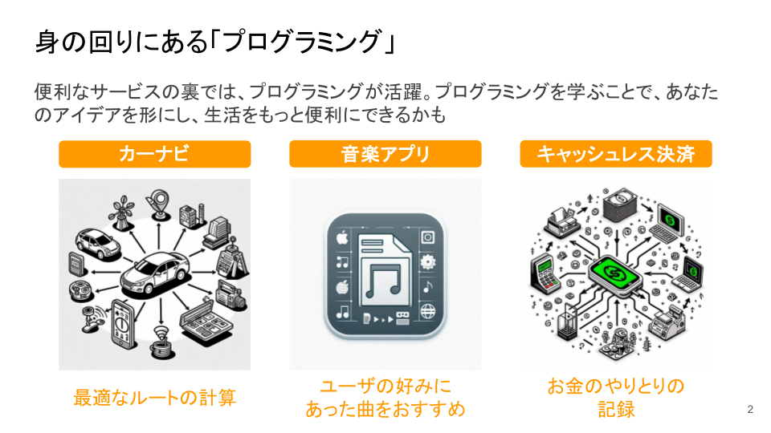

# 身の回りにある「プログラミング」

スマートフォンで天気を確認し、SNSで友人の投稿をチェックし、動画を楽しむ。
これらはすべて 「プログラム」 によって動いています。

🚗 カーナビ は目的地までの最適なルートを計算し、
🎵 音楽アプリ はあなたの好みに合った曲をおすすめし、
💳 キャッシュレス決済 は一瞬でお金のやり取りを記録します。

こうした便利なサービスの裏側では、プログラミングが活躍しています。
つまり、あなたはすでに 「プログラムが生み出す世界」 に触れながら生活しているのです。

では、もし あなたがプログラムを作る側になったら？
あなたのアイデアを形にしたり、生活をもっと便利にする仕組みを作ったりすることができます。

プログラミングは「特別な人のためのもの」ではありません。
少しずつ学びながら、自分だけのプログラムを作ることができるようになります。

さあ、一緒にプログラミングの世界へ踏み出してみませんか？

