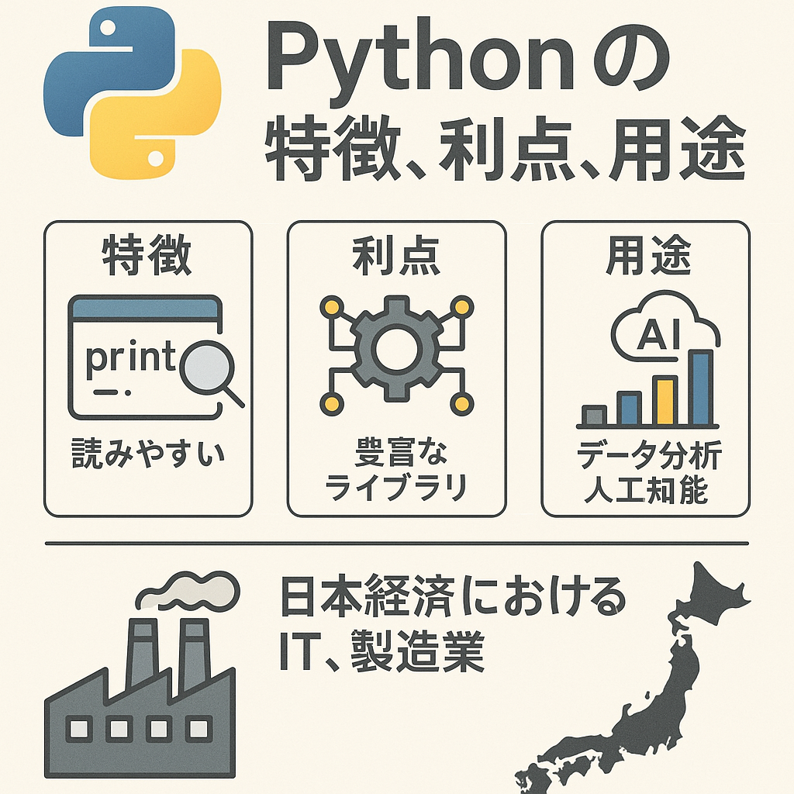

# プログラミング言語 Python の有用性

Pythonは、汎用的で高レベルなプログラミング言語であり、1980年代後半にグイド・ヴァンロッサムによって開発されました。以下に、Pythonの主要な特徴や利点、用途について詳しく説明します。

!!! info
    Python サイト [https://www.python.org](https://www.python.org)

## 特徴

1. シンプルで読みやすい構文
: Pythonはコードが読みやすく、理解しやすい構文を持っています。インデントによってブロックを構成するため、コードの可読性が高いです。

1. 動的型付け
: 変数の型を事前に宣言する必要がなく、実行時に型が決定されます。これにより、開発が迅速に行えます。

1. 豊富な標準ライブラリ
: Pythonは標準ライブラリが非常に充実しており、ネットワーキング、ファイルI/O、データ解析、ウェブサービスなど多くの機能を標準で提供しています。

1. オープンソース
: Pythonはオープンソースソフトウェアであり、無料で使用できるだけでなく、誰でも改良や配布が可能です。

1. 多様なパラダイムに対応
: Pythonはオブジェクト指向、手続き型、関数型など、さまざまなプログラミングパラダイムをサポートしています。

## 利点

1. 学習の容易さ
: シンプルな構文と読みやすさから、プログラミング初心者にも適しており、初めてプログラミングを学ぶ際に選ばれることが多いです。

1. 生産性の向上
: 開発速度が速く、プロトタイピングから本格的なアプリケーション開発まで幅広く対応できます。迅速な開発とテストが可能です。

1. コミュニティの大きさ
: Pythonのコミュニティは非常に大きく、豊富なドキュメント、チュートリアル、サポートフォーラムが存在します。困った時に助けを得やすい環境です。

1. クロスプラットフォーム
: Windows、Mac、Linuxなど、さまざまなプラットフォームで動作します。同じコードが異なるプラットフォームで動作するため、移植性が高いです。

## 用途

1. データサイエンスと機械学習
: Pandas、NumPy、SciPy、scikit-learn、TensorFlow、Kerasなど、多くのライブラリがデータ解析や機械学習に使用されており、Pythonはこの分野で非常に人気があります。

1. ウェブ開発
: Django、Flask、FastAPIなどのフレームワークを使用して、ウェブアプリケーションやAPIを開発することができます。

1. 自動化とスクリプティング
: 簡単なスクリプトを書いてタスクの自動化を行うことができます。例えば、ファイル操作やウェブスクレイピングなどが容易に実現できます。

1. ゲーム開発
: Pygameなどのライブラリを使用して、ゲーム開発に利用することもできます。

1. ネットワーキングとセキュリティ
: ネットワークプログラミングやセキュリティ関連のツール開発にも使用されます。TwistedやScapyなどのライブラリがあります。

Pythonはそのシンプルさと強力なライブラリ群により、幅広い分野で利用されています。学習のしやすさと多用途性から、初学者からプロフェッショナルまで多くの人々に支持されています。コミュニティのサポートも充実しているため、新しい技術を学びたい人にもお勧めの言語です。

## 日本経済のデジタル化に向けて

今後の日本経済のデジタル化に向けて、IT人材の教育と育成を進める上でPythonの有用性は非常に高いです。以下にその具体的な理由を述べます。

### 1. 学習の容易さと普及度

シンプルで読みやすい構文で初心者に優しい
: Pythonはシンプルで読みやすい構文を持ち、プログラミング初心者でも比較的短期間で習得できます。これにより、IT教育の導入が容易になります。

普及度とコミュニティの大きさで豊富なリソース
: Pythonは広く普及しており、教育用の教材やチュートリアル、オンラインコースが充実しています。これにより、教育プログラムの開発がスムーズに行えます。

### 2. 多用途性と実用性

データサイエンスと機械学習でデジタル化の中心技術
: データサイエンスや機械学習はデジタル化の中心技術です。PythonはPandas、NumPy、SciPy、TensorFlow、scikit-learnなどの強力なライブラリを持ち、これらの分野での実践的なスキルを身につけることができます。

自動化とスクリプティングで業務効率化
: Pythonは業務の自動化やスクリプティングに適しており、デジタル化による業務効率化の推進に貢献します。これにより、日常的なタスクの自動化やデータ処理の効率化が可能となります。

### 3. Web開発とソフトウェア開発

充実したフレームワークでウェブアプリケーションの構築が可能
: DjangoやFlaskなどのフレームワークを利用することで、ウェブアプリケーションやAPIの開発が容易に行えます。これにより、デジタルサービスの構築が迅速に進められます。

### 4. クラウドとIoT

クラウドサービスとの連携
: PythonはAWS、Google Cloud、Azureなど主要なクラウドサービスとの連携が容易であり、クラウドベースのアプリケーションやデータ処理に適しています。これにより、クラウド技術の学習と実践がスムーズに行えます。

IoTの開発
: PythonはRaspberry PiやArduinoなどのIoTデバイスのプログラミングにも適しており、IoTソリューションの開発に役立ちます。

### 5. 地域格差の解消

リモート学習のサポートできるオンラインリソース
: Pythonはオンラインリソースが豊富で、地方やリモートエリアでも高品質な教育を受けることができます。これにより、地域間のIT教育格差を縮小することが可能です。
地域のデジタル化支援

地域活性化
: 地方自治体や地元企業がPythonを活用することで、地域のデジタル化や新しいビジネスモデルの構築が進み、地域経済の活性化につながります。

### 6. 継続的な教育とリスキリング

リスキリングとアップスキリングで生涯学習にも
: Pythonの学習は既存の労働者に対するリスキリング（再教育）やアップスキリング（技能向上）にも適しており、労働市場の変化に柔軟に対応できるIT人材の育成に役立ちます。
Pythonはその学習の容易さ、多用途性、豊富なライブラリ、クラウドおよびIoTとの連携の容易さから、今後の日本経済のデジタル化に向けたIT人材の教育と育成に非常に有用です。Pythonを活用した教育プログラムを導入することで、デジタル化に対応できる高度なスキルを持つIT人材を育成し、地域経済の活性化や業務の効率化を推進することが可能です。

## 製造業での利用

特に、製造業においても、Pythonはますます重要な役割を果たすようになっています。従来のハードウェア制御技術が枯れていく中で、Pythonの柔軟性と強力なライブラリは、製造業のデジタル化とスマートファクトリーの実現に向けた大きな助けとなっています。以下に、Pythonが製造業においてどのように装置を制御し、価値を提供できるかについて述べます。

### 1. 柔軟なハードウェア制御

シンプルなインターフェースでRaspberry PiやArduinoの活用
: PythonはRaspberry PiやArduinoなどのシングルボードコンピュータやマイクロコントローラと連携して動作することが容易です。これらのデバイスを使ってセンサーやアクチュエータを制御するためのコードを簡単に記述できます。

GPIOライブラリ
: GPIO（General Purpose Input/Output）ライブラリを使用して、ピンの読み書きを行い、さまざまなデバイスを制御できます。

pySerial
: シリアル通信を行うためのpySerialライブラリを使用すれば、シリアルポート経由でのデバイス通信が簡単に実現できます。

### 2. データ収集と分析

センサーのリアルタイムデータの収集
: Pythonを使用してセンサーからリアルタイムでデータを収集し、処理することが可能です。これにより、製造プロセスのモニタリングや異常検知が容易になります。

PandasとNumPyを使ったデータ解析
: データの収集後、PandasやNumPyを使用してデータを解析し、製造プロセスの改善に役立つインサイトを得ることができます。

機械学習
: scikit-learnやTensorFlowを用いて、収集したデータから機械学習モデルを構築し、予知保全や品質管理に活用できます。

### 3. 製造プロセスの自動化

自動化スクリプトでタスクの自動化
: Pythonを使用して、製造ラインのタスクを自動化するスクリプトを簡単に作成できます。これにより、効率の向上とエラーの削減が可能です。

ロボティクスの制御、ロボットアームの制御
: PythonはROS（Robot Operating System）と統合して、ロボットアームやAGV（Automated Guided Vehicle）の制御に使用できます。

### 4. 既存システムとの統合

ERPやMESシステムとのシステム統合
: PythonはAPIを使用してERP（Enterprise Resource Planning）やMES（Manufacturing Execution System）などの既存システムと統合するためのインターフェースを提供します。これにより、工場全体のデジタルエコシステムが構築できます。

### 5. IoTとスマートファクトリー

IoTデバイスの統合でエッジコンピューティング
: Pythonを使用してエッジデバイスを制御し、ローカルでデータを処理することで、遅延を最小限に抑えつつリアルタイムのフィードバックを提供できます。

クラウド連携
: AWS IoTやAzure IoTなどのクラウドサービスと連携して、収集したデータをクラウドに送信し、分析や可視化を行うことが可能です。

Pythonはその柔軟性と強力なライブラリにより、製造業のハードウェア制御、データ収集、分析、自動化、既存システムとの統合、そしてIoTデバイスの管理といった幅広い分野で利用可能です。従来のハードウェア制御技術が枯れていく中で、Pythonは新しい技術スタックとして、製造業のデジタル化とスマートファクトリー化を推進する重要なツールとなります。これにより、製造プロセスの効率化、品質向上、コスト削減が実現し、競争力の強化に寄与します。