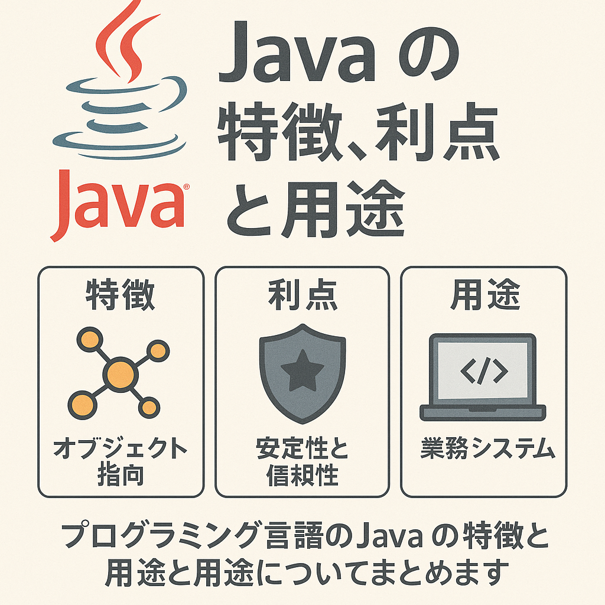

# プログラミング言語Javaについて

Javaは、Sun Microsystems（現在はOracle Corporationの一部）によって1995年にリリースされたオブジェクト指向のプログラミング言語およびプラットフォームです。以下に、Javaの主要な特徴や利点、用途について詳しく説明します。

!!! info
    Javaの日本語サイト [https://www.java.com/ja/](https://www.java.com/ja){:target}

## 特徴
1. プラットフォーム独立性
: Javaプログラムは、Java仮想マシン（JVM）上で実行されるため、どのプラットフォームでも動作します。これは「Write Once, Run Anywhere（WORA）」の理念に基づいています。

2. オブジェクト指向
: Javaは完全なオブジェクト指向言語であり、データとメソッドをオブジェクトとしてモデル化します。

3. 自動メモリ管理
: ガベージコレクションを利用して不要なオブジェクトを自動的にメモリから解放します。

4. 豊富な標準ライブラリ
: Javaには、グラフィカルユーザインタフェース（GUI）からネットワークプログラミングまで、多種多様な標準ライブラリが用意されています。

5. 高いセキュリティ
: Javaはセキュリティに関する強力な機能を提供し、サンドボックスモデルにより未検証のコードを安全に実行できます。

## 利点

1. 高い信頼性と安定性
: Javaはその堅牢な設計により、信頼性と安定性が高く、長期間にわたり使用されています。

1. 大規模なエコシステム
: Javaのエコシステムは非常に大規模で、フレームワーク、ライブラリ、ツールが豊富に存在します。

1. スケーラビリティ
: Javaは大規模なエンタープライズシステムやアプリケーションの開発に適しており、スケーラビリティが高いです。

1. 強力な開発ツール
: Eclipse、IntelliJ IDEA、NetBeansなどの統合開発環境（IDE）や、Maven、Gradleといったビルドツールが充実しています。

1. 広範なコミュニティサポート
: 世界中に広がる開発者コミュニティによってサポートされており、豊富なリソースと情報が入手可能です。

## 用途

1. エンタープライズアプリケーション
: Javaはエンタープライズ向けのアプリケーション開発に広く使用されており、特に銀行、保険、金融などの分野で重宝されています。Java EE（Enterprise Edition）やSpring Frameworkを利用することで、大規模なビジネスアプリケーションの開発が容易です。

1. モバイルアプリケーション
: Androidアプリケーションの開発にはJavaが主に使用されています。Android SDKはJavaをベースにしており、Kotlinと併用されています。

1. ウェブアプリケーション
: サーバーサイドプログラミングにおいて、Javaは非常に人気があります。Apache TomcatやJettyといったサーブレットコンテナや、Spring Bootなどのフレームワークを使用して、スケーラブルなウェブアプリケーションを構築できます。

1. 分散システム
: Apache HadoopやApache Kafkaといった分散システムはJavaで実装されており、大規模なデータ処理やメッセージングシステムの構築に利用されています。

1. デスクトップアプリケーション
: JavaFXやSwingを使用して、クロスプラットフォームのデスクトップアプリケーションを開発できます。

## まとめ

Javaは、そのプラットフォーム独立性、オブジェクト指向設計、豊富な標準ライブラリ、自動メモリ管理などの特徴から、多くの分野で広く使用されている信頼性の高いプログラミング言語です。エンタープライズアプリケーション、モバイルアプリケーション、ウェブアプリケーション、分散システム、デスクトップアプリケーションなど、多岐にわたる用途に対応できる強力なツールを提供します。豊富なコミュニティサポートと開発ツールにより、開発者にとって使いやすく、生産性を高めることができます。