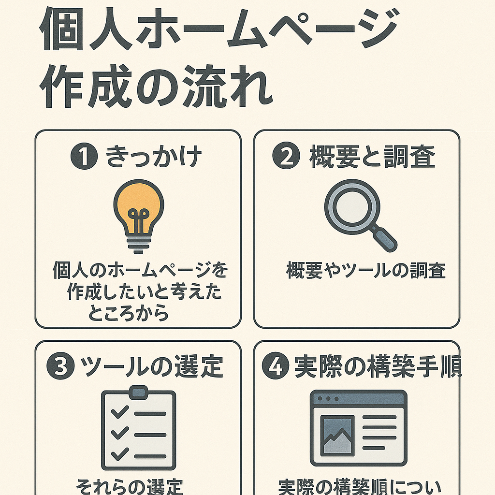
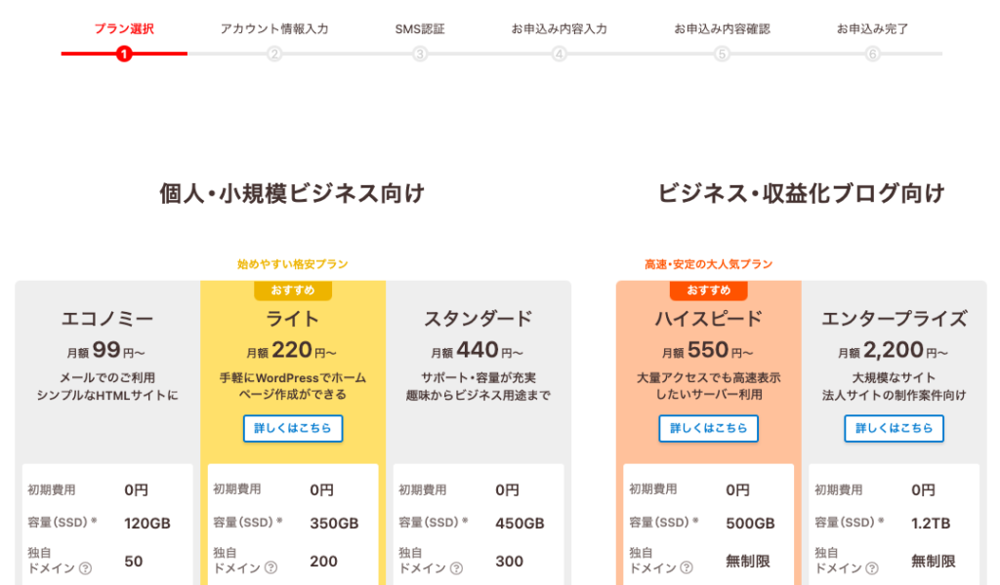
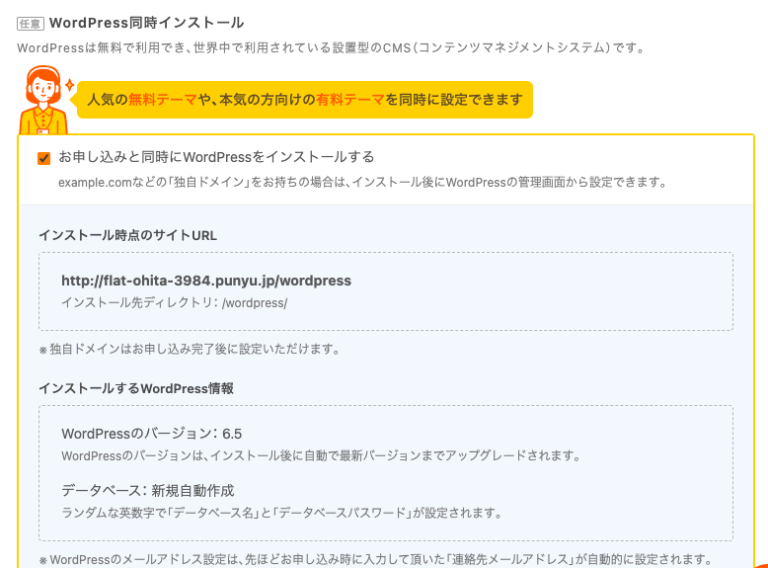
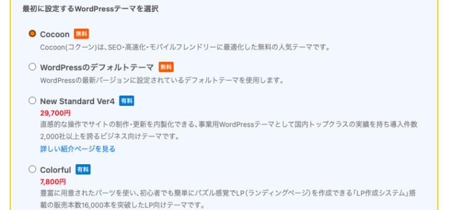
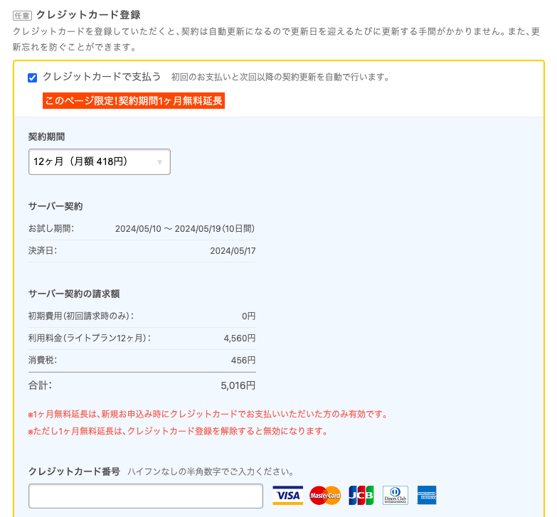

# 自分のホームページを作りたい

ずっとやってみたいとは思っていたが、コストもかかりそうとのことで躊躇していたが、思うところもあり少し時間を使ってやってみようと思いました。

 

具体的にはこんな用途で自分のホームページを利用したい思いがあります。

- 日々、調べていることや検証していることをアウトプットすることで整理したい
- 意識的にアウトプットして調査、検証をより洗練させていきたい
- アフィリエイトによる収益化なることができるのであればもちろんやりたい
- 将来的にプログラミングを学べるコンテンツを作っていきたいとの思いはあるので、その材料としたい
- 将来的に開業できるものなら、事業のHPを作成する準備をしていきたい
- 学生のころなど物書きになりたいと思った時期もあり、自分の学びや考えを発信していきたい願望がある

## ホームページを作るには？

次のステップで検討します。

1. **目的の明確化**

: まず、ホームページを作る目的を明確にします。自分やビジネスの紹介、ブログ、ポートフォリオなど、どのような情報を発信するかを考えましょう。

1. **ドメインとホスティングの取得**

: ホームページを公開するために、ドメイン（ウェブサイトのアドレス）とホスティング（ウェブサイトを保存するサーバー）を取得する必要があります。多くのサービスが提供していますので、予算や必要な機能に合わせて選びましょう。

1. **プラットフォームの選択**

: ホームページを構築するためのプラットフォームを選択します。WordPressやWix、Squarespaceなどのプラットフォームは、初心者でも使いやすく、多くのテンプレートやプラグインが提供されています。
テーマやデザインの選択: 選んだプラットフォームで利用できるテーマやデザインを選択します。自分のイメージやブランドに合ったものを選びましょう。

1. **コンテンツの作成**

: ホームページに表示するコンテンツを作成します。文章や画像、ビデオなど、必要な情報を整理して追加していきます。

1. **ページの構築**

: 選んだテーマやデザインを元に、実際のページを構築していきます。各ページに必要なコンテンツを追加し、レイアウトを調整します。

1. **テストと公開**

: ホームページが完成したら、動作確認を行いましょう。リンクやフォームが正しく動作しているかをチェックし、必要な修正を加えます。その後、ホームページを公開して、世界中の人にアクセスできるようにします。

## プラットフォームの選択

ホームページ、ウェブサイトを作成したい場合は、CMS（コンテンツマネジメントシステム）のプラットフォームを利用すると、記事の投稿管理、サイトのデザイン、SEO対策、アリフィエイトの設定などを行うことができます。いくつかのCMSのうち、WordPressは世界的にもシェア6割、日本では8割と、システムにこだわりがなければWordPressを採用しましょう。そのほかのシステムにはShopify、Wix、Drupalなどがあります。

1. WordPress

: WordPressは、最も広く使用されているCMSの1つです。オープンソースで無料で利用でき、カスタマイズ性が高いのが特徴です。
数多くのテーマやプラグインが提供されており、さまざまな用途に対応できます。ブログや企業サイト、オンラインストアなどに利用されています。
コーディングの知識がなくても使いやすいため、初心者でも利用しやすいです。

1. Shopify

: Shopifyは、オンラインストアを構築し運営するためのプラットフォームです。主にeコマースサイト向けに設計されています。
オンライン決済、在庫管理、商品の管理、注文処理など、eコマースに必要な機能がすべて統合されています。
テーマストアからテンプレートを選択して独自のストアを作成し、アプリストアから必要な機能を追加することができます。
eコマースに特化しており、初心者でも使いやすいインターフェースを提供しています。

1. Wix

: Wixは、ドラッグ＆ドロップでウェブサイトを作成できるクラウドベースのプラットフォームです。テンプレートから選んで簡単にデザインできます。
インタラクティブなエディターを備えており、直感的に操作できます。初心者にもおすすめです。
基本的な機能は無料で利用できますが、高度な機能やカスタマイズをする場合は有料プランが必要です。

1. Squarespace

: Squarespaceは、デザイン性に優れたウェブサイトを作成できるプラットフォームです。美しいテンプレートが豊富に用意されています。
ドラッグ＆ドロップで簡単にカスタマイズでき、レスポンシブデザインにも対応しています。
ウェブサイトの制作だけでなく、ブログやオンラインストアの構築も可能です。

1. Drupal

: Drupalは、オープンソースのコンテンツ管理システムであり、高度なウェブサイトやアプリケーションを構築するために使用されます。
柔軟性と拡張性に優れており、大規模なウェブサイトやポータル、コミュニティサイトなどに適しています。
カスタムコンテンツタイプやビュー、ユーザー管理など、様々な機能を自由に設計できます。
ただし、DrupalはWordPressやWixなどと比べると学習コストが高く、技術的な知識が必要です。

## WordPress

WordPressに関連して、WordPress.comとWordPress.orgがあります。初めWordPress.comの方でサイトを作成し始めましたが、両者の違いを認識し、.comの方で作りかけていたサイトは削除しました。.comはホスティングサービスのようで、いわゆるWebサイト制作はWordPress.orgを使ってサイトを作ることを指します。

1. ホスティング
    - WordPress.com
    : WordPress.comは、WordPressが提供するホステッドプラットフォームです。WordPress.comがホスティングを提供し、WordPressのサイトを管理します。
    - WordPress.org
    : WordPress.orgは、WordPressのオープンソースソフトウェアのダウンロードと使用を提供しますが、ホスティングはユーザー自身で用意する必要があります。

1. カスタマイズ性:
    - WordPress.com
    : WordPress.comでは、テーマやプラグインの選択が制限されています。有料プランを利用すると、より多くのカスタマイズオプションが提供されますが、完全なカスタマイズは制限されています。
    - WordPress.org
    : WordPress.orgを使用すると、自由にテーマやプラグインを選択し、カスタマイズすることができます。自分でホスティングを管理するため、完全な制御が可能です。

1. 広告:
    - WordPress.com
    : WordPress.comの無料プランでは、WordPress.comの広告が表示される場合があります。有料プランでは広告が非表示になります。
    - WordPress.org
    : WordPress.orgを使用する場合、ユーザーが自分で広告を管理できます。広告を表示するかどうかは、ユーザー自身で決めることができます。

1. 料金:
    - WordPress.com
    : WordPress.comは無料プランから有料プランまでさまざまなプランが用意されています。有料プランにはさまざまな追加機能が含まれています。
    - WordPress.org
    : WordPress.orgのソフトウェアは無料で利用できますが、ホスティングやドメインなどのコストがかかります。これらのコストは、ユーザーが選択したホスティングプロバイダーやプランによって異なります。

## ドメインとホスティングの取得

WordPress自体はサーバにインストールするソフトウェアおよびデータベースで、プロバイダからサーバをレンタルし、そのレンタルサーバにWordPressをインストールすることでプラットフォームを利用することができます。そうしてそこでサイトやブログを作成することができるようになります。

WordPressを構築できるサーバを提供しているプロバイダの大手は、エックスサーバ、ロリポップサーバ、ConoHa WING、さくらのレンタルサーバなどがホスティングサービスを行なっております。

1. エックスサーバ

: エックスサーバは、日本のレンタルサーバーで、WordPressを含むさまざまなウェブサイト用のホスティングを提供しています。
シェアードホスティングやVPS（仮想専用サーバー）、専用サーバーなど、さまざまなプランが用意されています。
日本語のサポートが充実しており、初心者から上級者まで幅広く利用されています。

1. ロリポップサーバ

: ロリポップサーバは、日本のレンタルサーバーで、WordPressやMovable Type、EC-CUBEなどのCMSに対応しています。
シェアードホスティングやクラウドホスティング、VPSなど、様々なプランが提供されています。
初心者向けの使いやすい管理画面や、多彩なアプリケーションに対応した環境が特徴です。

1. ConoHa WING

: ConoHa WINGは、日本のクラウドサービスプロバイダで、VPS（仮想専用サーバー）を中心に提供しています。
コストパフォーマンスに優れており、高性能なサーバーをリーズナブルな価格で提供しています。
高いカスタマイズ性やスケーラビリティを求めるユーザーに人気があります。
さくらのレンタルサーバ:
さくらのレンタルサーバは、日本の老舗のレンタルサーバーで、多くのユーザーに利用されています。
シェアードホスティングやVPS、専用サーバーなど、幅広いプランが用意されています。
独自のコントロールパネルや豊富な機能が提供されており、安定性と信頼性が高いとされています。

!!! info
    WordPressでおすすめのレンタルサーバー大手4社比較【2025年最新】
    [https://goworkship.com/magazine/wordpress-server](https://goworkship.com/magazine/wordpress-server){:target="_blank"}

## ロリポップサーバ

その中でも最初は個人利用で小さく検証したいため、安価はロリポップサーバを選択します。

ロリポップのプラン

- 個人、小規模ビジネス向け … エコノミー / ライト / スタンダード
- ビジネス、収益化ブログ向け … ハイスピード / エンタープライズ

まずは個人利用で検証したいため、ライトプランを選択します。

!!! quote
    

    LPLOPOP! by GMOペパボ 「個人・小規模ビジネス向け」 [https://lolipop.jp/order/form](https://lolipop.jp/order/form){:target="_blank"}

## WordPressのインストール

レンタルサーバ契約時にWordPressのインストールを行うことができます。

CocoonというWordPressのテーマを選択します。

引き落としのクレカを登録します。12ヶ月で5,016円でウェブサイト作成を始めることができます。

以上、ロリポップのサービスでレンタルサーバを契約し、WordPressをインストールすることができ、ホームページにブログを作成する環境を作ることができました。これからこのブログやホームページを改良していく方法を調べていこうと思います。