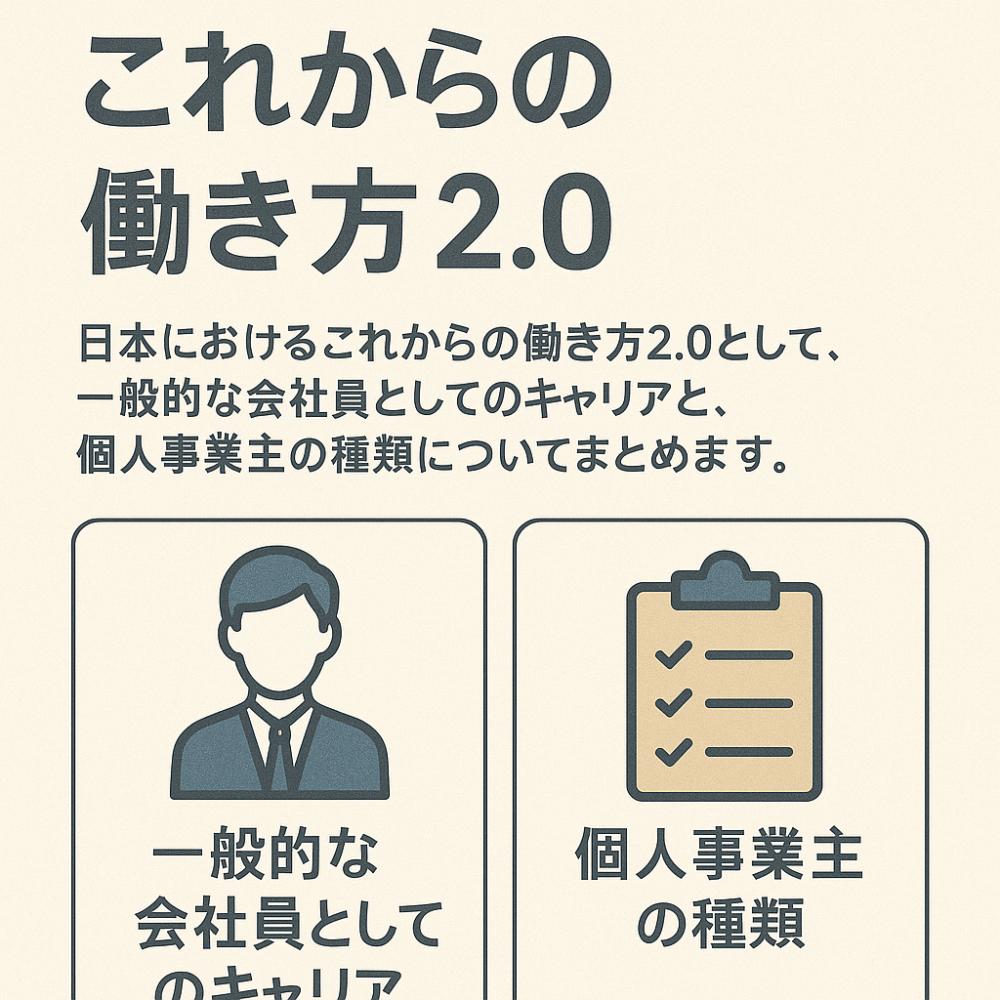

# 働き方2.0

高校や高専、専門や大学、大学院を経ていざ社会に出ても、特に昨今は様々な働き方が存在します。就職活動をして会社に入社したり、公務員となったり、YouTuberとなって自分で生計を立てたり、いったん企業に入社してその後独立を目指したり。一般企業に入社した人は会社員、YouTuberになった人は個人事業主、脱サラ後独立する人はフリーランスなど、法律的な観点からその働き方によって与えられる人格があります。今回は働き方によって社会的に与えられる人格や形態についてまとめたいと思います。

----

## 会社員

企業に入社して会社の事業に勤める人は会社員です。会社員は経営から与えられる仕事や業務に対して、労働規則の範囲で作業を行い、事業の業績や、個人及びチームまたは組織の成果に対して評価を下されます。入社した企業が有名であれば家族に報告したときに賞賛されるように会社に対して信用があり、事業もその信用を元に成り立っています。例え個人ができる程度のミスを一つしても、会社が潰れることはまずありません。会社員が日々行う業務については会社の事業内容に従い、そのやり方も会社の定める労働時間や休日などの就業規則に従います。責任の範囲も先の通り与えられた業務に依存し、個人の成果に対して即収入に結びつくことはなく、組織に対して報酬が与えられた上で、それを個人に配分します。

納税の観点では、原則として会社が給与から天引きして代わりに国に納めるというものがあり、個人としては細部を把握することなく、組織としての担当に任せることができるとういうことがあります。会社や組織が許容する経費を申請することができますが、必要と思うものでも個人で判断することはもちろんできず、組織の意思決定プロセスに従う必要があります。

年金について、会社員が企業に勤める限り”厚生年金”を受けることができます。健康保険も、組合健保・協会けんぽなどの社会保険を、会社と保険料と折半する形で受けることができます。そのほか、会社経由で雇用保険や労災保険をうけることができるようになっております。

## 個人事業主

個人で事業を営む人は個人事業主です。法律によって”法人”と”個人”は分けて扱われます。個人事業主も法律に定められている呼称です。会社員と比べると、事業内容や規則などは個人事業主に責任があり、個人の意思で自由に決めることができます。他にも会社員にとっての定年というものがなく、好きな事業でいつまで働くこともできるし、その逆に個人が満足するのであれば事業を切り上げる選択も行うことが可能です。

納税や経費も個人でっもれなく行う必要があります。また国民保険、国民健康保険に加入し、会社人のように雇用保険、労災保険といったものはありません。

個人事業は開業届を提出することで事業を始めることができます。法人と比べると所得における税負担の割合が大きくなるといった面があり、税率だけで見ると課税所得が330万円を超えると法人の方が有利となり、さらには900万円を超えるとその差がかなり大きくなります。事業が大きくなると法人の方が得られるメリットが大きなり、個人事業として開業したのち、軌道に乗ったら法人化するといったことができます。個人事業主が法人化することを”法人成り”と言います。

### 個人事業の種類

#### フリーランス

フリーランスとは会社に属さずに独立した立場で、企業などから仕事を請け負う働き方を行う人を指し示す言葉です。フリーランスとして、プログラマー・デザイナー・カメラマン・イラストレーター・ライター・コンサルタントを職種として働く例があります。フリーランスは個人事業主です。一方で、飲食業や小売業は企業から仕事を請け負っているわけではないので、フリーランスとは言いません。

#### 業務委託

企業と雇用契約を結ばず、企業と同じ立場で業務を受けることを、業務委託と言います。企業は業務の一部を企業間で依頼したり、フリーランスに対して依頼したりします。業務委託契約には、請負契約や準委任契約があります。

#### SOHO; 在宅ビジネス

在宅ビジネスまたはスモールオフィス・ホームオフィスの頭文字をとってSOHOは、電話、PC、インターネットなどを駆使して自宅で事業を完結するビジネスのことを言います。会社と特定の雇用契約を結んでオフィスに出社して勤務するのではなく、フリーランスとして独立した立場で事業を営む場合に在宅のみで業務を行うとSOHOとなります。個人事業を行う際に、事務所や店舗をかまえるのに比べ、開業のハードルがかなり低くなることがメリットです。一方で在宅で完結する場合は仕事とプライベートのオン・オフがつかなくなる傾向にあることや、仕事場に招くことができないことで社会的信用を得づらいなどのデメリットもあり、開業当初は自宅で仕事を初めやはり軌道に乗ったら事務所を開設するといった方法も検討すべきです。またアフターコロナを機にリモートワークと出社による勤務のハイブリッド型を規則としている企業も多いなか、職種によっては出社したところで終日作業に終わるといったことも多かったり、チームメンバーとのタイミングが合わずオフィスに出社しても結局打ち合わせは自席でパソコンに向かってWeb会議をしていたり、望ましい働き方を得られないといったケースがよくあります。スキルを持った人材がSOHOといった個人事業やフリーランスのメリット受けるために独立を検討するといったことも今後の働き方として検討する必要があります。

#### 自営業者

自営業者とは前述の法人であるか個人であるかにこだわらない場面で、事業を営んでいる人を指し示す言葉です。

#### 独立店舗経営

飲食店、小売店、教室、サロンなど規模の大きなスペースを確保して始めるビジネスが独立店舗です。開業にあたって設備投資などに資金を準備する必要があります。物件の家賃、補償金、外内装費などに200万~1,000万が必要となります。また開業後の運転資金を３ヶ月分見積もっておくことも事業維持の鍵となります。

#### フランチャイズ経営

コンビニや飲食店を代表に特定事業のブランドを持つ企業に契約を結んで加盟店を営むと、フランチャイズ経営となります。ブランドの加盟店として運営のノウハウや商品・サービスの開発、宣伝のサポートを受けることができます。実績や経験もなく個人事業主として独立する場合も、フランチャイズ加盟することで事業を軌道に乗せやすいといったメリットがあります。ラーメン店、飲食店、学習塾、ハウスクリーニング、修理業、美容院、サロン、介護、買取販売業など、自分の経験・スキルに問わず多岐に渡る業種から将来性のあるものを選択できます。事業が軌道に乗せやすい一方で、利益が上がらない場合でも本部へのロイヤリティや指定された仕入れ先への支払いなど定常的にかかるコストが負担になるといったリスクはあります。開業の準備資金の目安としては300万~4,500万と言われています。

#### 移動販売

主に飲食店の場合、独立店舗やフランチャイズで開業することの他に移動販売で事業を行う方法もあります。店舗を構えるより初期費用を抑えられる可能性があります。開業の準備資金の目安としては100万円~500万円と言われています。

#### ネット販売

ものを販売する事業では、店舗を持つ代わりに自宅でネット販売を営む方法もあります。実店舗経営に比べ固定費を安く済ませることができます。ECサイトは自分で運営するか、大手ECサイトを利用する方法もあります。大手ECサイトは楽天やYahoo!ショッポングのようなテナント型とAmazonのようなマーケットプレイス型などが存在します。開業の準備資金の目安として、10万円〜470万円と言われます。

以上、昨今では企業に勤めるだけではなく様々は働き方が存在する中、自分がよりパフォーマンスを発揮し社会に貢献できる働き方を立ち止まって考えてみてはいかがでしょうか？

----

## 参考

- [いちばんわかりやすい個人事業の始め方｜成美堂出版 (seibidoshuppan.co.jp)](https://www.seibidoshuppan.co.jp/product/9784415329918){:target="_blank"}
- [2023-2024年版 図解わかる　個人事業の始め方 宇田川　敏正(監修) – 新星出版社 | 版元ドットコム (hanmoto.com)](https://www.hanmoto.com/bd/isbn/9784405104297){:target="_blank"}