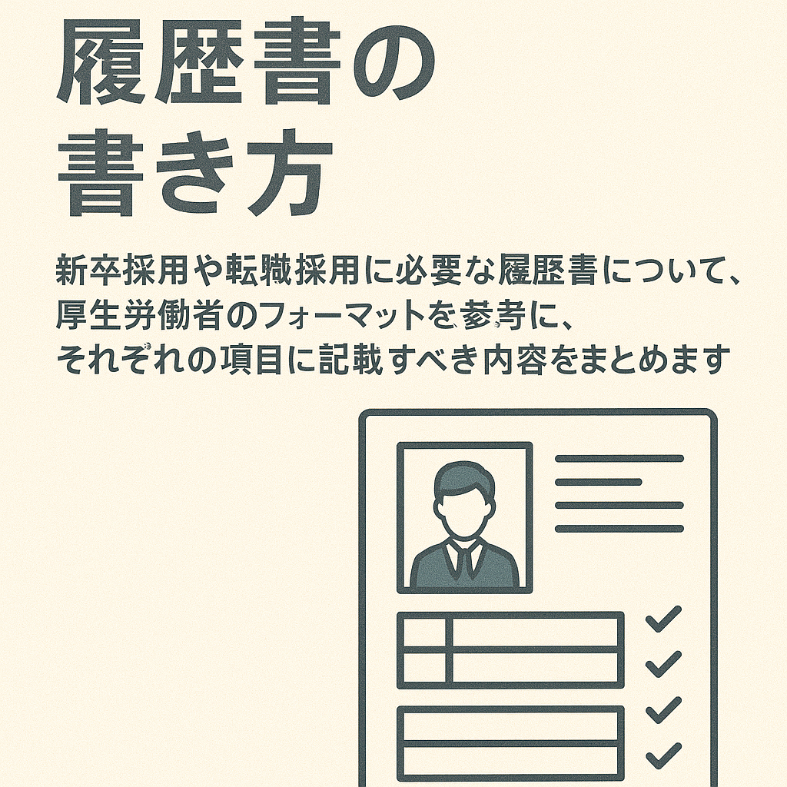

# 履歴書の書き方

 

企業に就職する際には、その会社の採用窓口に対して履歴書やエントリーシートを応募し、面接を受けることで内定を獲得し、その後入社します。学校を卒業しその後就職する場合は、新卒一括採用を利用することで企業の募集から希望する業務・職種など条件に合致する会社の選考に応募します。今回は就職活動をする上で必要な履歴書の書き方について説明します。

 

<object data="../../assets/000769665.pdf" type="application/pdf" style="width:100%;height:600px" aria-label="000769665"></object><a href="../../assets/000769665.pdf" download>履歴書のダウンロード</a>

## 記入事項について

### 履歴書の基本項目

1. 日付
    - 履歴書を作成した日付を記入します。
1. 氏名
    - フルネームを記入します。
    - ふりがなも忘れずに記入します。
1. 連絡先
    - 現住所と連絡先（電話番号、メールアドレスなど）を記入します。
    - 必要に応じて、別の連絡先も記入します。
1. 性別
    - 性別欄の記載は任意です。必要に応じて記入します。

### 写真

指定されたサイズの写真を貼付します。
縦4cm×横3cmのものを使用し、裏面に名前を記入してのりづけします。

!!! info
    [履歴書写真の撮り方マニュアル｜服装・サイズ・髪型・撮影方法をプロが解説！ ｜転職ならdoda（デューダ）](https://doda.jp/guide/rireki/photo.html){:target="_target"}

### 学歴・職歴

1. 学歴
    - 学歴は小学校卒業から順に記入します。
    - 学校名、入学・卒業年月を記入します。
1. 職歴
    - 職歴は最新のものから順に記入します。
    - 会社名、部署名、職務内容、在職期間を具体的に記載します。

### 免許・資格

- 保有している免許や資格を記入します。
- 資格名、取得年月を記載します。

### 志望動機、特技、アピールポイント

1. 志望動機
    - なぜその企業で働きたいのか、具体的な理由を記入します。
    - 企業の理念や事業内容に共感した点などを挙げると良いです。
1. 特技
    - 自分の特技を記入します。
    - 仕事に役立つスキルや能力を強調します。
1. アピールポイント
    - 自分の強みやこれまでの経験で学んだことを記載します。
    - 具体的なエピソードを交えて記述すると良いです。

### 本人希望記入欄

1. 希望の職種
    - 希望する職種を記入します。
1. 給与
    - 希望する給与水準を記入します（必要に応じて）。
1. 勤務時間・勤務地
    - 希望する勤務時間や勤務地を記入します。

### その他のポイント

- 正確な情報の記載: すべての情報は正確に記入します。
- 読みやすさ: 整理されたレイアウトと丁寧な字で記入します。
- 簡潔さと具体性: 重要なポイントは簡潔に、しかし具体的に記述します。

この履歴書を基に企業に応募する際、具体的な志望動機や自分の強みをしっかりとアピールすることが大切です。準備をしっかり行い、自分を最も良く表現できるように工夫しましょう。

----

## 志望の動機、特技、好きな学科、アピールポイントなど

「志望の動機、特技、好きな学科、アピールポイントなど」を書く際のポイントと具体例を以下に示します。受かりやすい書き方のコツは、具体的で明確な情報を提供し、企業や職種との関連性を示すことです。

### 志望の動機

- 企業研究
: 企業の理念、事業内容、業績を理解し、それに共感した点を述べる。
- 具体性
: 自分の経験やスキルがどのように役立つかを具体的に述べる。
- 例文
: 「私は貴社の『環境に優しい技術開発』という理念に強く共感し、応募いたしました。大学では環境工学を専攻し、特に再生可能エネルギーの研究に力を入れてきました。卒業研究では太陽光発電の効率化について取り組み、その成果として学会で発表する機会を得ました。貴社のプロジェクトで私の知識と経験を活かし、さらに成長していきたいと考えております。」

### 特技

- 具体的なスキル
: 具体的なスキルや技術を挙げる。
- 職務関連性
: その特技がどのように仕事に役立つかを述べる。
- 例文
: 「私の特技はプログラミングです。大学ではPythonやJavaを学び、複数のプロジェクトで実践してきました。特に、チームでのWebアプリケーション開発において、バックエンドの設計と実装を担当しました。この経験から、チームワークと技術力を兼ね備えた人材として貴社に貢献できると確信しています。」

### 好きな学科

- 具体的な学科
: 好きな学科を具体的に挙げる。
- 関連する学び
: その学科で学んだことがどのように役立つかを述べる。
- 例文
: 「私の好きな学科はマーケティングです。消費者心理学の授業では、消費者の行動パターンを分析する方法を学びました。この知識を基に、大学のプロジェクトで新製品のマーケティング戦略を立案し、実際に売り上げを20％増加させることができました。この経験を貴社のマーケティング部門で活かしたいと考えております。」

### アピールポイント

- 具体的なエピソード
: 実績や成果を具体的なエピソードを交えて述べる。
- 貢献できる点
: 自分の強みがどのように企業に貢献できるかを述べる。
- 例文
: 「私の強みは問題解決能力です。大学の研究プロジェクトで、予算不足の問題に直面しましたが、チームメンバーと協力してスポンサーを見つけることに成功しました。その結果、プロジェクトは無事に完了し、成果は学会で高く評価されました。このような困難な状況でも柔軟に対応し、解決策を見つけ出す力を貴社で発揮したいと考えています。」

### 総括

- **具体性を持たせる:** 抽象的な表現ではなく、具体的なエピソードや成果を記述する。
- **企業との関連性を強調:** 自分のスキルや経験が企業や職種にどう役立つかを明確に示す。
- **誠実さを伝える:** 志望動機やアピールポイントは、誠実な思いを込めて書くことが大切です。

これらのポイントを押さえて書くことで、企業に対して自分の価値を効果的にアピールできる履歴書を作成することができます。

## 本人希望記入欄

「本人希望記入欄」に記載する内容は、企業に対してあなたの希望を伝える重要な項目です。しかし、あまりにも具体的で厳格な要求を記載すると、採用のハードルを上げてしまうこともあります。そこで、以下のようなポイントを考慮してバランスよく記載することが重要です。

### 1. 給料

- 柔軟性を示す
: 明確な希望額を記載する場合でも、柔軟性を示す表現を加える。
- 業界水準を参考に
: 業界の平均給与を参考にし、現実的な範囲で希望を述べる。
- 例文
: 「御社の給与体系に従いますが、可能であれば○○万円程度を希望いたします。」

### 2. 職種

- 具体性と柔軟性のバランス
: 希望する職種を具体的に記載するが、他の職種にも対応可能であることを示す。
- 例文
: 「マーケティング部門での勤務を希望しておりますが、営業部門での経験もありますので、そちらのポジションでも貢献できると考えています。」

### 3. 勤務時間

- 希望を述べるが柔軟に対応する意向を示す
: 特別な事情がない限り、フルタイムや規定の勤務時間に従う旨を伝える。
- 例文
: 「基本的には規定の勤務時間に従いますが、プロジェクトの進捗状況に応じて柔軟に対応いたします。」

### 4. 勤務地

- 希望を述べつつ柔軟性を示す
: 特定の勤務地を希望する理由がある場合でも、他の勤務地にも対応できる旨を伝える。
- 例文
: 「関東エリアを希望しておりますが、貴社のニーズに応じて全国どこでも勤務可能です。」

### 5. その他

- 具体的な条件や環境
: 働きやすさや成長機会に関する希望を記載する。
- 企業への貢献を強調
: 自分の希望が企業の利益にもつながることを示す。
- 例文
: 「自分のスキルを最大限に活かせるプロジェクトに参加できる環境を希望します。また、継続的な学習やスキルアップの機会を提供していただけるとありがたいです。」

### 総括
- **柔軟性を強調:** 企業のニーズに応じて対応できる姿勢を示すことで、前向きな印象を与える。
- **現実的な希望を記載:** 自分の希望を述べつつも、企業の現実に即した内容にする。
- **貢献の姿勢を示す:** 自分の希望が企業にとってもメリットがあることをアピールする。

これらのポイントを踏まえて「本人希望記入欄」を記載することで、企業側にポジティブな印象を与え、採用の可能性を高めることができます。

----

いかがでしたでしょうか？履歴書の書き方のポイントを押さえて、採用されやすい書類を作成できるようになった上で、希望の働き方を手に入れるために頑張りましょう。

!!! note
    今回説明した履歴書のフォーマットは厚生労働省が推奨する履歴書の様式例を参考にしています。

----

## 参考

[新たな履歴書の様式例の作成について (mhlw.go.jp)](https://www.mhlw.go.jp/stf/newpage_kouseisaiyou030416.html)