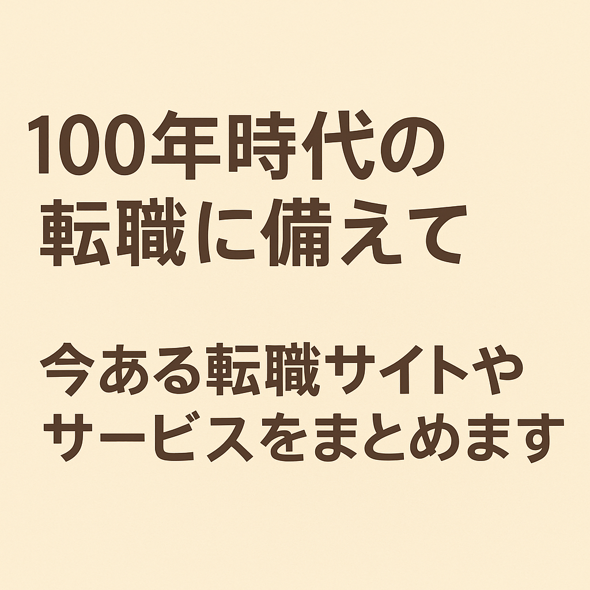

 

今のキャリアで満足していますか？

 

この先定年70歳まで働かなければいけないとすると、今の働き方が自分にとってベストなのか日々考えている人も多いかと思います。不満を抱きながら働くことはストレスを引き起こす可能性がありますし、人生の大部分を過ごす職場は居心地の良い場所であることが望ましいです。転職サイトに登録することで、新しい可能性や職場環境を探ることができます。転職を考える際には、現在の不満や希望する条件、キャリアの方向性などをよく考えてみると良いでしょう。また、転職を検討する際には、過去の経験やスキル、興味を含めて自分の強みや弱みを理解することも重要です。どんな選択をするにしても、自分の人生を考えて慎重に行動することが大切です。

 

今回は、今の自分の市場価値を確かめるためにも、どんな転職サイトがあるのか、まとめてみようと思います。

 

----

## ビズリーチ

ビジネスパーソン、国内外の優良・成長企業、各業界に精通した一流ヘッドハンターの三者を最適かつ効率的にマッチングする即戦力人材に特化した会員制転職サイトです。ビズリーチサイトの職務経歴書に自己の経歴を入力していくと、企業からのスカウトやヘッドハンターからのスカウトメッセージを受け取ることができるようになります。企業の人事担当やヘッドハンターは、ビズリーチ上の求職者会員の情報を検索することができ、職務経歴の詳細を確認した上でスカウトを送るか考えます。自分の望む職場や職種の求人を行う人事やヘッドハンターがどのように求人情報を検索するのかを想像して、それに応えられるような職務経歴内容を記載するということが重要になります。企業やヘッドハンターとマッチングすると、選考プロセスの前に電話やWeb会議ツールを使ったカジュアル面談を申し込まれたり、ビズリーチのメッセージを機能ではなくメールアドレスでもやりとりを申し込まれたりといったようにスカウトによった進め方に応じなければいけません。まだヘッドハンターによっては、複数の求人に対しての選考を取りまとめて、スケジュールを調整して、複数内定を獲得した上で最終的な判断ができるように調整してくれることもあります。

[https://www.bizreach.co.jp](https://www.bizreach.co.jp){:target="_blank"}

## doda

dodaのサイトでは選考状況を確認することができるといった機能もあります。人気企業300社の合格診断、適職探しのヒントが見つかる転職タイプ診断といったツールも利用することができる。ただ、それぞれのツールを使って診断をしたいときに都度自分のプロフィールを入力しなければいけないところは使い勝手に課題がある。

[https://doda.jp](https://doda.jp){:target="_blank"}

### doda X

doda Xは小栗旬さんがテレビCMに出演する、会員の８割以上が年収600万円以上のハイクラス転職サービスです。

[https://doda-x.jp](https://doda-x.jp){:target="_blank"}

### リクルートエージェント

リクルートエージェントは、転職成功実績No.1、厳選非公開求人数21万件以上、専門コンサルタントがフルサポートの転職サイトです。

[https://www.r-agent.com](https://www.r-agent.com){:target="_blank"}

### リクルートダイレクトスカウト

リクルートダイレクトスカウトは、転職決定年収平均925万円以上、年収800万〜2,000万円の求人12万件以上掲載、レジュメ登録の１ヶ月の平均スカウト受信数23通の強みを持つ転職サイトです。

[ttps://directscout.recruit.co.jp](https://directscout.recruit.co.jp){:target="_blank"}

### Geekly

Geeklyは希望のIT職種への転職成功割合95%、IT/Web求人数30,000件以上、年収UP率80%を誇るエンジニア、クリエイター転職のためのサービスです。

[https://www.geekly.co.jp](https://www.geekly.co.jp){:target="_blank"}

----

いかがだったでしょうか？自分のスキルやキャリアに合いそうなサイトに当たりをつけて、複数登録し求人の流入や内定までのスケジュールを調整して、スムーズな転職活動を目指しましょう！

