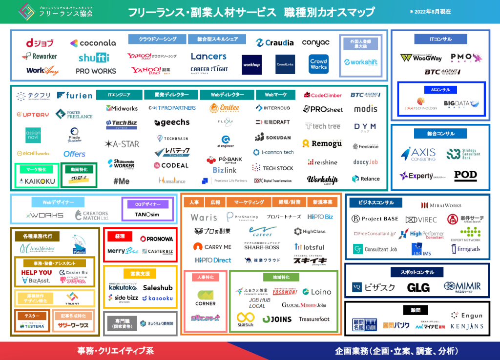

# フリーランスITエンジニアの案件サイトまとめ

 

みなさんは今の仕事に満足していますか？

 

会社員として働くITエンジニアはある程度働いても自分の希望するキャリアに進める人はほと握りです。SEは多岐にわたる仕事やときにはマネージャのマネジメントまで行う必要があります。業務が雑多になっていくと成果がぼやけていき、会社からも評価されづらくなっていき、キャリアが頭打ちになることもしばしばあります。会社からの評価を得られないと当然昇給やボーナスが上がっていかず、プログラマーに支払っている外注単価の方が、たとえ諸経費を考えたとしても自分の給料と逆転し始めたと感じることはありませんか？

もしフリーランスとして独立して、現職を案件として受注することができるのであれば、会社から給料として受け取る収入より、案件の売上から保険や税金を引いた利益を収入とする方が年収が上がる場合もあるのではないでしょうか。会社が1社員の管理にかかる費用と1プログラマーにかける発注単価を検討すると、会社としてもWin-Winになります。

大手企業のプロジェクトをフリーランスとしてそのまま受注するのは難しいかもしれませんが、会社の限られた選択肢の中からプロジェクトのアサインを模索するよりは、案件サイトやエージェントをうまく利用すれば、より広い社会の中の選択肢から自分の指向する案件から多角的に活動できるのではないでしょうか？

今回はそういったフリーランスの可能性の仮説を検証するため、世の中の案件サイトを調べてまとめようと思います。

また、将来的なポートフォリの構築を考え始めた駆け出しのフリーランスの方にも、あらためてどんなサイトがあるのか確認できるかと思います。

## レバテックフリーランス

[https://levtech.jp/lt102](https://levtech.jp/lt102){:target="_blank"}

レバテックはITエンジニアをはじめとした、約50職種のIT専門職をサポートしている。ITに特化した専任のアドバイザーが自分にぴったりの求人・案件を提案してくれる。対象は、フリーランス、正社員転職、学生就職などがある。レバテックフリーランスでは無料サポート登録を行うことができる。登録から案件参画までの流れは、基本情報・スキル・経験・希望の入力後、案件の提案・カウンセリングを実施、クライアント先訪問、参画となる。エージェント系

レバテックが競合としてベンチマークしている雰囲気があるサービス：

- クラウドワークス
- クラウドテック
- ランサーズエージェント
- PE-BANK
- geechs job
- ランサーズ
- ITプロパートナーズ
- Midworks

## Midworks

[https://lp.mid-works.com/003-02](https://lp.mid-works.com/003-02){:target="_blank"}

Midworksは豊富な案件数と社員並みの充実保障で、やりがいと自由だけではなく、安心も提供するITフリーランスエンジニアのための専用エージェントです。Midworksでは案件ごとの発注金額を公表することで、フリーランスもマージン率を知ることができるようになっています。マージン率は各種保証を組み合わせて実質10%~15%となっているようです。エージェントの中では低マージンとなっているようです。エージェント系

## エンジニアファクトリー
[https://www.engineer-factory.com/freelance/lp/lp07](https://www.engineer-factory.com/freelance/lp/lp07){:target="_blank"}

エージェント系

## クラウドワークス
[https://crowdworks.jp](https://crowdworks.jp){:target="_blank"}

オンライン上で完結するような仕事の募集や受注をできるプラットフォームとなっている。ワーカーにとっては、単価数千円からといった単発の依頼やプロジェクトメンバーとしてのSES提供といった様々な依頼から応募することができる。クライアントにとって同種の案件を募集して発注することができるようになっている。クワウドワークの始めたては、どのような案件傾向に対して自分のスキルで仕事をこなせるか勘所がなく人材としてのポジションも確立できていないため、大量の案件の中から自分に合いそうなもの探すことにハードルがありそう。

ただエージェントから自律して自分のペースで案件獲得が安定してくれば、本業は目指す事業のための作業を行いつつも副業的に収入を作っておくといったフリーランスの事業スタンスをとることはできるかもしれません。

みんなのカレッジという月額3,4100円〜のクラウドワーカーのためのオンラインコミュニティもある。

## ギークスジョブ
[https://geechs-job.com/lp/17/kanto-3](https://geechs-job.com/lp/17/kanto-3){:target}

ギーグジョブは、リモート可能案件が80%以上、エンド直だから高単価、上場企業の安心と信頼のサポートといった特徴のあるサービスです。BtoC系の案件ジャンルが42.6%という構成になっています。

## 参考：サービス事業者のカオスマップ

最後に、サービスを俯瞰できるカオスマップをネット上で見つけることができたので記載します。その他のカオスマップはITエンジニア/クリエイター/マーケターといった案件が求める職能のみでカテゴリ訳されていましたが、下記のものはクラウドサービス/スキルシェアといったサービス自体のポジショニングでもカテゴライズされていたことが、とても参考になりそうです。

!!! quote

    [「フリーランス・副業人材サービスカオスマップ2022」を公開](https://blog.freelance-jp.org/20220603-15345/){:target}