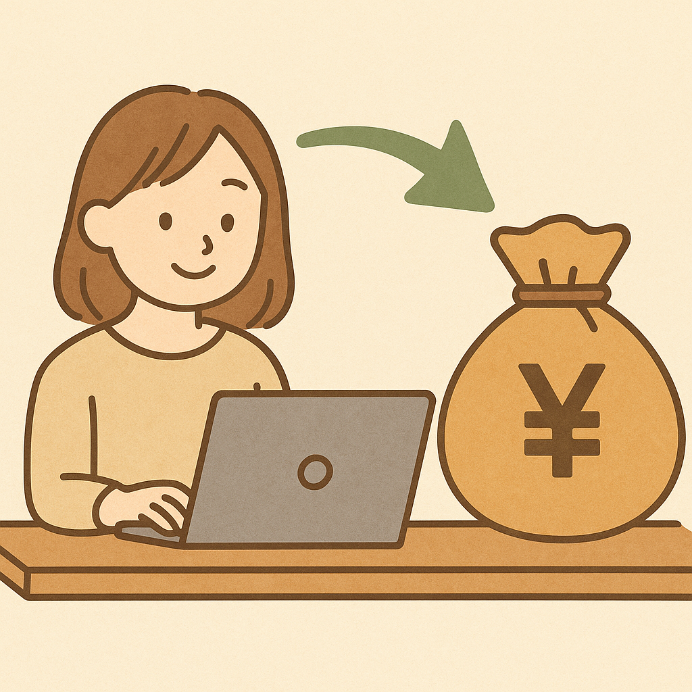

# ブログの収益化までにやること

ブログサイトを構築し、アフィリエイトで収益を得るためには以下のステップを踏む必要があります。

1. テーマの選定
: ブログのテーマを決定します。自分の興味や知識があり、かつ市場の需要があるテーマを選ぶことが重要です。

1. ドメインとホスティングの選定
: ブログのドメイン名（例：myblog.com）を決めて購入します。また、ブログを運営するためのホスティングサービスも選定して契約します。お勧めのホスティングサービスには以下があります：
    - Xserver
    - ConoHa WING
    - ロリポップ！

1. ブログプラットフォームの選定とインストール
: 多くのブロガーはWordPressを使用します。WordPressは無料で使いやすく、多くのプラグインやテーマが提供されています。ホスティングサービスの管理画面から簡単にインストールできます。

1. ブログのデザインとカスタマイズ
: テーマ（外観）を選び、ブログのデザインをカスタマイズします。無料テーマと有料テーマがありますが、有料テーマの方がデザイン性やカスタマイズ性が高いことが多いです。

1. 必要なプラグインのインストール
: WordPressには多くのプラグインがあります。以下のようなプラグインをインストールすると便利です：

    - SEO対策用のプラグイン（例：Yoast SEO）
    - アナリティクス（例：Google Analytics）
    - スパム対策（例：Akismet）
    - バックアップ（例：UpdraftPlus）

1. 記事の作成
: 読者にとって価値のあるコンテンツを作成します。定期的に記事を更新し、ブログを活発に保ちます。

1. SEO対策
: SEO（検索エンジン最適化）を行い、検索エンジンからのトラフィックを増やします。キーワードリサーチを行い、記事に適切なキーワードを含めることが重要です。

1. アフィリエイトプログラムへの登録
: アフィリエイトプログラムに登録することで、商品やサービスの紹介を行い、紹介料（コミッション）を得ることができます。以下に、主要なアフィリエイトプログラムとその登録手順を紹介します。

    **主なアフィリエイトプログラム：**

    1. A8.net
        - 日本最大級のアフィリエイトサービスプロバイダー（ASP）。
        - 様々な企業や商品のアフィリエイトプログラムが揃っています。
    1. アクセストレード
        - 多くの企業が参加しているASP。
        - 特に金融や保険、不動産などのジャンルが充実。

    1. もしもアフィリエイト
        - 手数料が低めで初心者にも使いやすいASP。
        - Amazonや楽天市場のアフィリエイトが可能。
    1. 楽天アフィリエイト
        - 楽天市場の商品を紹介して報酬を得ることができます。
        - 手数料は楽天ポイントで支払われることが多いです。
    1. Amazonアソシエイト
        - Amazonの商品を紹介して報酬を得ることができます。
        - 広範囲の商品を扱えるため、多くのブロガーが利用。

    **登録手順：**

    各アフィリエイトプログラムに共通する基本的な登録手順を以下に示します。

    1. サイトにアクセス
        - それぞれのアフィリエイトプログラムの公式サイトにアクセスします。
            - [A8.net](https://www.a8.net/){:target}
            - [アクセストレード](https://www.accesstrade.ne.jp/){:target}
            - [もしもアフィリエイト](https://www.moshimo-affiliate.com/){:target}
            - [Amazonアソシエイト](https://affiliate.amazon.co.jp/){:target}
    1. アカウント作成
        - 各サイトの「新規登録」または「アカウント作成」ボタンをクリックし、必要情報を入力してアカウントを作成します。
        - 通常、以下の情報が必要です。
            - 名前
            - メールアドレス
            - ブログURL
            - ブログのテーマや内容
            - 報酬を受け取る口座情報
            - その他の連絡先情報
    1. ブログの審査
        - 作成したアカウントでログインし、ブログをアフィリエイトプログラムに登録します。
        - 一部のプログラムではブログの内容やトラフィックなどを審査されることがあります。
        - 審査が通過すると、アフィリエイトリンクを利用できるようになります。
    1. アフィリエイトリンクの取得
        - プログラムのダッシュボードにログインし、紹介したい商品やサービスのアフィリエイトリンクを取得します。
        - リンクはHTML形式や短縮URL形式で提供されることが多いです。
    1. ブログへのリンクの挿入
        - 取得したアフィリエイトリンクをブログの記事内に挿入します。
        - 自然な形でリンクを挿入し、読者に対して有益な情報として提供します。

        **例：Amazonアソシエイト申請の審査プロセスについて**

        - サインアップから180日以内に3回以上の適格販売の発生が必要
        - 少なくとも10件のオリジナルコンテンツの投稿の公開が必要
        - コンテンツは60日以内に更新されている必要がある

        [https://affiliate.amazon.co.jp/help/node/topic/G8TW5AE9XL2VX9VM](https://affiliate.amazon.co.jp/help/node/topic/G8TW5AE9XL2VX9VM){:target}

        **コツと注意点**

        - **複数のASPを利用：**一つのASPに限定せず、複数のASPに登録して幅広い選択肢を持つことが重要です。
        - **正直なレビュー：**商品のレビューや紹介記事を書く際には、正直な意見を述べることが信頼性を高めます。
        - **プライバシーポリシーの記載：**ブログにプライバシーポリシーや免責事項を明記し、アフィリエイトリンクを含むことを読者に通知します。

        アフィリエイトプログラムへの登録とリンクの使用は、収益化を始めるための重要なステップです。注意深く行い、読者に価値ある情報を提供することを心がけましょう。

1. アフィリエイトリンクの挿入
: ブログ記事にアフィリエイトリンクを挿入します。リンクは自然な形で挿入し、読者に対して有益な情報として提供することが大切です。

1. プロモーションとSNSの活用
: ブログをプロモーションし、SNSを活用してトラフィックを増やします。Twitter、Facebook、Instagramなどでブログ記事をシェアします。

1. パフォーマンスの分析と改善
: Google Analyticsなどのツールを使用して、ブログのパフォーマンスを定期的に分析し、改善点を見つけて実行します。

----

これらのステップを踏むことで、ブログサイトを構築し、アフィリエイトで収益を得ることができます。定期的な更新と改善が成功の鍵です。