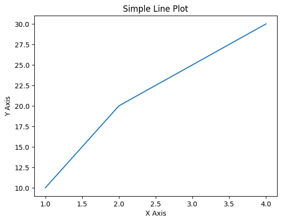

# モジュール

---

## 1. 部品を使おう

### Pythonで使える部品たち

プログラムを書くときには、基本的な変数や関数だけでなく、さまざまな便利な「部品」を活用できます。Pythonには、標準で提供されている「組み込み関数」や「標準ライブラリ」、自作や他者が作成した「モジュール」や「パッケージ」、そしてインターネット上で配布されている「外部ライブラリ」など、多くの部品が用意されています。これらを活用することで、より効率的にプログラムを作成できます。

ここでは、それぞれの部品について簡単に紹介します。

---

__1. 組み込み関数（Built-in Functions）__

Pythonには、最初から使える便利な関数が多く用意されています。例えば：
- `print()` : 画面に出力する
- `len()` : 要素の数を取得する
- `int()` / float() : 数値の型変換
- `str()` : 文字列の型変換

これらの関数は、特別な準備をしなくてもすぐに利用できます。

---

__2. モジュール（Module）__

Pythonでは、便利な機能が「モジュール」としてまとめられています。例えば：
- `math` : 数学関数（平方根や三角関数など）
- `random` : 乱数を扱う
- `datetime` : 日付や時間を扱う

これらのモジュールを利用するには、`import` 文を使います。

```python
import math
print(math.sqrt(16))  # 4.0
```

---

__3. パッケージ（Package）__

モジュールをさらに整理してまとめたものが「パッケージ」です。例えば `numpy` や `pandas` などのライブラリは、複数のモジュールから構成されています。

```python
import numpy as np
print(np.array([1, 2, 3]))
```

---

__4. 外部ライブラリ（External Libraries）__

Pythonでは、世界中の開発者が作成した便利なライブラリをインストールして使うことができます。例えば：
- `matplotlib` : グラフ描画
- `requests` : Web API との通信
- `pandas` : データ解析

外部ライブラリを使うには、`pip` を利用してインストールします。

```bash
pip install requests
```

このように、Pythonには便利な「部品」が豊富に用意されています。次の章では、それぞれの部品について詳しく学んでいきましょう。

---

## 2. 組み込み関数

### 組み込み関数とは

Python には、あらかじめ用意されている「組み込み関数（Built-in Functions）」が多数あります。これらの関数は、特別な準備をしなくても、Python をインストールした時点でそのまま使うことができます。

例えば、次のような機能を提供する組み込み関数があります：

- データの出力: `print()`
- データの型変換: `int()`, `float()`, `str()`
- リストや文字列の長さ取得: `len()`
- 数値の計算: `abs()`, `sum()`, `min()`, `max()`
- データの並び替え: `sorted()`, `reversed()`
- 要素の取得: `enumerate()`, `zip()`
- 関数を適用する: `map()`, `filter()`

組み込み関数を使うことで、プログラムを短くシンプルに書くことができ、より効率的なコーディングが可能になります。

---

__例：基本的な組み込み関数の使用__

以下のコードでは、いくつかの組み込み関数を試してみます。

**プログラム：**
```python
# 文字列を画面に出力
print("Hello, Python!")
```

**出力：**
```bash
Hello, Python!
```

**プログラム：**
```python
# 数値の型変換
num_str = "123"
num_int = int(num_str)
print(num_int)
```

**出力：**
```bash
123
```

**プログラム：**
```python
# リストの要素数を取得
fruits = ["apple", "banana", "cherry"]
print(len(fruits))
```

**出力：**
```bash
3
```

**プログラム：**
```python
# 最小値・最大値を求める
numbers = [10, 20, 5, 40]
print(min(numbers))
print(max(numbers))
```

**出力：**
```bash
5
40
```

---

__なぜ組み込み関数を使うのか？__

組み込み関数を使うことで、次のようなメリットがあります。

1. コードが簡潔になる
:   例えば、`sum(numbers)` を使えば、ループを使わずにリストの合計が求められます。
1. パフォーマンスが向上する
:   組み込み関数は Python の内部で最適化されており、自作の関数より高速に動作することが多いです。
1. 可読性が向上する
:   `sorted(numbers)` のように、わかりやすい関数名がついているため、コードの意図が伝わりやすくなります。

---

### ファイル入出力

Python では、`open()` 関数を使ってファイルを開き、データを読み書きすることができます。ファイルを扱う際は、正しく開閉することが重要です。ここでは、標準入力から受け取ったテキストをファイルに保存するプログラムを、段階的に説明します。

---

__1. `open()` と `close()` を使った基本的なファイル書き込み__

まずは、`open()` と `close()` を使って、標準入力から受け取ったテキストをファイルに保存する方法を見てみましょう。

**プログラム：**
```python
file = open("output.txt", "a")  # "a" は追記モード
text = input("保存するテキストを入力してください: ")
file.write(text + '\n')
file.close()
print("テキストを output.txt に保存しました。")
```

**出力：**
```bash
保存するテキストを入力してください:  好きなテレビ番組はありますか
テキストを output.txt に保存しました。
```

**出力（再度同じプログラムを実行する）：**

**出力：**
```bash
保存するテキストを入力してください:  ネットテレビをよく見ます
テキストを output.txt に保存しました。
```

ポイント

- `open("output.txt", "a")` でファイルを開く。
    - `"a"` は「追記モード（add）」を意味します。既存のファイルがある場合は上書きされます。
- `file.write(text)` でテキストを書き込む。
- `file.close()` でファイルを閉じる。
    - ファイルを閉じないと、データが正しく保存されなかったり、メモリを無駄に消費したりする可能性があります。
 
---

__2. with 文を使ってファイルを開く__

ファイルを開いたら必ず `close()` しなければなりませんが、もし `close()` を忘れると、データが保存されないことがあります。
そこで、`with` 文を使うと、自動的に `close()` してくれるので便利です。

**プログラム：**
```python
with open("output.txt", "a") as file:
    text = input("保存するテキストを入力してください: ")
    file.write(text + '\n')

print("テキストを output.txt に保存しました。")
```

**出力：**
```bash
保存するテキストを入力してください:  タイムリープしている
テキストを output.txt に保存しました。
```

`with` 文を使うメリット

- `with` ブロックを抜けると、自動的に `close()` される。
- `close()` の書き忘れを防げる。
- エラーが発生した場合でも、ファイルが適切に閉じられる。

## 3. モジュールの利用

### モジュールとは

Python には、「モジュール（Module）」という仕組みがあります。モジュールとは、Python の機能をまとめたファイルのことで、再利用可能なコードを整理して管理するために使われます。
Python には標準で用意されている「標準モジュール」のほか、自分で作成する「自作モジュール」や、外部からインストールできる「外部モジュール」があります。

__モジュールを使うメリット__

1. コードの再利用
:   一度作成した関数やクラスを、別のプログラムでも簡単に使い回せます。
1. コードの整理
:   機能ごとに分割して管理できるため、コードが見やすくなります。
1. Python の標準機能を簡単に利用
:   Python には多くの便利な標準モジュールがあり、すぐに活用できます。

### 標準ライブラリ

Python には、あらかじめ多くの便利なモジュールが「標準ライブラリ（Standard Library）」として用意されています。
標準ライブラリは、追加のインストールなしで Python に最初から含まれており、`import` するだけですぐに使うことができます。

例えば、以下のような標準ライブラリがあります：

| モジュール | 主な機能 |
| -- | -- |
| `math` | 数学計算（平方根、三角関数、対数など）|
| `random` | 乱数の生成 |
| `datetime` | 日付・時刻の操作 |
| `os` | OS の操作（ファイル・ディレクトリ操作）|
| `sys` | システム情報の取得（コマンドライン引数など）|
| `json` | JSON 形式のデータを扱う |
| `csv` | CSV ファイルを読み書きする |
| `re` | 正規表現を使った文字列処理 |
| `urllib` | Web からデータを取得する |
| `collections` | 高度なデータ構造（デフォルト辞書、キューなど）|

---

### モジュールの取り込み

Python では、`import` 文を使ってモジュールを取り込み、さまざまな機能を利用できます。
モジュールの取り込み方にはいくつかの方法があり、それぞれ用途に応じて使い分けることが重要です。

__1. 基本的な import の使い方__

最も基本的な方法は、`import モジュール名` でモジュール全体を取り込む方法です。
この場合、モジュール内の関数や変数を使うときは `モジュール名.関数名` のように記述します。

**プログラム：**
```python
import math

print(math.sqrt(16))
print(math.pi)
```

**出力：**
```bash
4.0
3.141592653589793
```

✅ メリット

- モジュール名を明示するため、どのモジュールの関数を使っているか分かりやすい。

⚠️ 注意点

- モジュール名を毎回書く必要があるため、コードが長くなることがある。
 
__2. 別名（エイリアス）をつける__

モジュール名が長い場合や、短く書きたい場合は `as` を使って別名（エイリアス）をつけられます。

**プログラム：**
```python
import numpy as np

print(np.sqrt(16))
```

**出力：**
```bash
4.0
```

✅ メリット

- コードを短くできる。
- よく使うモジュールに対して一般的な別名をつけることで、可読性が向上する（例: `numpy` → `np`、`pandas` → `pd`）。

--- 

### 特定の関数や変数だけを取り込む

モジュール全体ではなく、一部の関数や変数だけを使いたい場合は、`from` を使います。

**プログラム：**
```python
from math import sqrt, pi

print(sqrt(16))
print(pi)
```

**出力：**
```bash
4.0
3.141592653589793
```

✅ メリット

- `math.sqrt()` ではなく、`sqrt()` のように直接関数を呼び出せる。
- 必要な機能だけをインポートするので、コードがシンプルになる。

⚠️ 注意点

- どのモジュールの関数かわかりにくくなることがある。

---

### ワイルドカードインポート

すべての関数や変数をインポートしたい場合は、`*`（ワイルドカード）を使います。

**プログラム：**
```python
from math import *

print(sqrt(16))
print(pi)
```

**出力：**
```bash
4.0
3.141592653589793
```

⚠️ 注意点（非推奨）

- どの関数がどのモジュール由来なのか分かりにくくなる。
- 他のモジュールと関数名が衝突する可能性があるため、基本的には避ける。

---

### モジュール取り込みのまとめ

| 方法 | 記述例 | 特徴 |
| -- | -- | -- |
| `import モジュール名` | `import math` | 標準的な方法。`math.sqrt()` のようにモジュール名をつけて使う。 |
| `import モジュール名 as 別名` | `import numpy as np` | モジュール名を短縮できる。よく使うモジュールに便利。 |
| `from モジュール名 import 関数名` | `from math import sqrt, pi` | 必要な関数のみをインポートでき、短く書ける。 |
| `from モジュール名 import *` | `from math import *` | すべての関数をインポート。関数名の衝突に注意。 |

---

## 4. パッケージの利用

### パッケージとは
Python における「パッケージ」は、関連するモジュールをまとめたディレクトリのことを指します。
パッケージを使うことで、大規模なプロジェクトやライブラリを管理しやすくすることができます。パッケージは、モジュールが整理された形で提供され、各モジュールのファイルを簡単にインポートして利用できます。

__1. パッケージの構成__

パッケージは、基本的に以下のような構造を持っています。

```bash
mypackage/                # パッケージのディレクトリ
    __init__.py           # パッケージの初期化ファイル（必須）
    module1.py            # モジュール1
    module2.py            # モジュール2
    subpackage/           # サブパッケージ（さらにモジュールを持つディレクトリ）
        __init__.py
        submodule.py
```

- `mypackage/` がパッケージのディレクトリです。
- `__init__.py` はそのディレクトリがパッケージであることを示すために必要なファイルです。このファイルは空でも構いませんが、パッケージがインポートされたときに初期化処理を行うために使われることもあります。
- 各モジュール（`module1.py` や `module2.py`）やサブパッケージ（`subpackage/`）は、パッケージ内の機能を構成するファイルです。

__2. パッケージのインポート__

パッケージ内のモジュールをインポートするには、次のように記述します。

1. モジュールのインポート

    ```python
    import mypackage.module1

    mypackage.module1.some_function()
    ```

2. サブパッケージ内のモジュールのインポート

    ```python
    import mypackage.subpackage.submodule

    mypackage.subpackage.submodule.some_function()
    ```

3. パッケージ全体をインポート

    ```python
    import mypackage

    mypackage.module1.some_function()
    mypackage.module2.another_function()
    ```

---

### パッケージ内のモジュールを取り込む

__1. パッケージの利用例__

たとえば、`requests` という人気のある外部ライブラリは、実際には多くのモジュールを含むパッケージです。

```python
import requests

response = requests.get("https://example.com")
print(response.text)
```

`requests` は、HTTP 通信に関するさまざまな機能を提供するモジュールを集めたパッケージです。

__2. サブパッケージ__

パッケージはサブパッケージを持つことができます。サブパッケージもパッケージと同じようにモジュールや他のサブパッケージを持つことができ、さらに階層的に管理できます。

```python
import mypackage.subpackage.submodule
```

このように、パッケージは階層的に構造を持つことができます。

---

## 5. 外部ライブラリの利用

### 外部ライブラリとは

外部ライブラリ（または外部モジュール）とは、Pythonの標準ライブラリには含まれていないが、Pythonコミュニティや第三者の開発者が提供している、追加機能を持ったモジュールやパッケージです。これらのライブラリは、特定の問題を解決するために非常に便利で、しばしば公式のパッケージリポジトリである Python Package Index (PyPI) からインストールして利用します。

外部ライブラリを使うことで、標準ライブラリではできないような特定の機能や、複雑な処理を簡単に実現できます。

---

### 外部ライブラリの準備

外部ライブラリは、Python のパッケージ管理ツールである `pip` を使ってインストールします。pip は、PyPI からパッケージを簡単にインストールできるツールです。

```bash
pip install パッケージ名
```

例えば、`requests` ライブラリをインストールするには次のようにします。

```bash
pip install requests
```

---

### matplotlib

`matplotlib` は、データの可視化に非常に便利なライブラリです。特に、グラフやプロットを作成するために広く利用されます。以下は、`matplotlib` を使って簡単な折れ線グラフを描く例です。

__インストール__

まず、`matplotlib` をインストールします。

**コマンド：**
```bash
pip install matplotlib
```

**出力：**
```bash
Defaulting to user installation because normal site-packages is not writeable
Collecting matplotlib
    Downloading matplotlib-3.9.4-cp39-cp39-macosx_11_0_arm64.whl (7.8 MB)
     |████████████████████████████████| 7.8 MB 6.1 MB/s eta 0:00:01
[?25hRequirement already satisfied: packaging>=20.0 in /Users/masayuki/Library/Python/3.9/lib/python/site-packages (from matplotlib) (24.2)
Collecting pyparsing>=2.3.1
    Downloading pyparsing-3.2.3-py3-none-any.whl (111 kB)
     |████████████████████████████████| 111 kB 9.7 MB/s eta 0:00:01
[?25hCollecting fonttools>=4.22.0
    Downloading fonttools-4.56.0-cp39-cp39-macosx_10_9_universal2.whl (2.8 MB)
     |████████████████████████████████| 2.8 MB 7.2 MB/s eta 0:00:01
[?25hCollecting cycler>=0.10
    Downloading cycler-0.12.1-py3-none-any.whl (8.3 kB)
Collecting importlib-resources>=3.2.0
    Downloading importlib_resources-6.5.2-py3-none-any.whl (37 kB)
Collecting pillow>=8
    Downloading pillow-11.1.0-cp39-cp39-macosx_11_0_arm64.whl (3.1 MB)
     |████████████████████████████████| 3.1 MB 5.5 MB/s eta 0:00:01
[?25hRequirement already satisfied: python-dateutil>=2.7 in /Users/masayuki/Library/Python/3.9/lib/python/site-packages (from matplotlib) (2.9.0.post0)
Collecting kiwisolver>=1.3.1
    Downloading kiwisolver-1.4.7-cp39-cp39-macosx_11_0_arm64.whl (64 kB)
     |████████████████████████████████| 64 kB 9.2 MB/s  eta 0:00:01
[?25hCollecting contourpy>=1.0.1
    Downloading contourpy-1.3.0-cp39-cp39-macosx_11_0_arm64.whl (249 kB)
     |████████████████████████████████| 249 kB 6.9 MB/s eta 0:00:01
[?25hRequirement already satisfied: numpy>=1.23 in /Users/masayuki/Library/Python/3.9/lib/python/site-packages (from matplotlib) (2.0.2)
Requirement already satisfied: zipp>=3.1.0 in /Users/masayuki/Library/Python/3.9/lib/python/site-packages (from importlib-resources>=3.2.0->matplotlib) (3.21.0)
Requirement already satisfied: six>=1.5 in /Library/Developer/CommandLineTools/Library/Frameworks/Python3.framework/Versions/3.9/lib/python3.9/site-packages (from python-dateutil>=2.7->matplotlib) (1.15.0)
Installing collected packages: pyparsing, pillow, kiwisolver, importlib-resources, fonttools, cycler, contourpy, matplotlib
Successfully installed contourpy-1.3.0 cycler-0.12.1 fonttools-4.56.0 importlib-resources-6.5.2 kiwisolver-1.4.7 matplotlib-3.9.4 pillow-11.1.0 pyparsing-3.2.3
WARNING: You are using pip version 21.2.4; however, version 25.0.1 is available.
You should consider upgrading via the '/Library/Developer/CommandLineTools/usr/bin/python3 -m pip install --upgrade pip' command.
```

**プログラム：**
```python
import matplotlib.pyplot as plt

x = [1, 2, 3, 4]
y = [10, 20, 25, 30]

plt.plot(x, y)

plt.title('Simple Line Plot')
plt.xlabel('X Axis')
plt.ylabel('Y Axis')

plt.show()
```

**出力：**



解説

- `plt.plot(x, y)` で `x` と `y` のデータを元に折れ線グラフを作成します。
- `plt.title()` や `plt.xlabel()`, `plt.ylabel()` でグラフのタイトルや軸ラベルを設定します。
- `plt.show()` でグラフを画面に表示します。

このように、`matplotlib` を使うことで、データの可視化が簡単に行えます。

---

### requests

`requests` は、Web サイトからデータを取得したり、API と通信したりする際に便利なライブラリです。例えば、指定した URL からデータを取得し、その内容を表示するプログラムを作成できます。

__インストール__

まず、`requests` をインストールします。

**コマンド：**
```bash
pip install requests
```

```bash
Defaulting to user installation because normal site-packages is not writeable
Requirement already satisfied: requests in /Users/masayuki/Library/Python/3.9/lib/python/site-packages (2.32.3)
Requirement already satisfied: urllib3<3,>=1.21.1 in /Users/masayuki/Library/Python/3.9/lib/python/site-packages (from requests) (2.3.0)
Requirement already satisfied: idna<4,>=2.5 in /Users/masayuki/Library/Python/3.9/lib/python/site-packages (from requests) (3.10)
Requirement already satisfied: certifi>=2017.4.17 in /Users/masayuki/Library/Python/3.9/lib/python/site-packages (from requests) (2025.1.31)
Requirement already satisfied: charset-normalizer<4,>=2 in /Users/masayuki/Library/Python/3.9/lib/python/site-packages (from requests) (3.4.1)
WARNING: You are using pip version 21.2.4; however, version 25.0.1 is available.
You should consider upgrading via the '/Library/Developer/CommandLineTools/usr/bin/python3 -m pip install --upgrade pip' command.
```

**プログラム：**
```python
import requests

response = requests.get("https://jsonplaceholder.typicode.com/posts")

if response.status_code == 200:
    print("Request was successful!")
    posts = response.json()
    print(posts[0])  # 最初の投稿を表示
else:
    print("Request failed with status code:", response.status_code)
```

**出力：**
```bash
Request was successful!
{'userId': 1, 'id': 1, 'title': 'sunt aut facere repellat provident occaecati excepturi optio reprehenderit', 'body': 'quia et suscipit\nsuscipit recusandae consequuntur expedita et cum\nreprehenderit molestiae ut ut quas totam\nnostrum rerum est autem sunt rem eveniet architecto'}


/Users/masayuki/Library/Python/3.9/lib/python/site-packages/urllib3/__init__.py:35: NotOpenSSLWarning: urllib3 v2 only supports OpenSSL 1.1.1+, currently the 'ssl' module is compiled with 'LibreSSL 2.8.3'. See: https://github.com/urllib3/urllib3/issues/3020
    warnings.warn(
```

解説

- `requests.get()` メソッドを使って、指定した URL に HTTP GET リクエストを送信します。
- `response.status_code` でリクエストのステータスコードを確認できます。200 は成功を意味します。
- `response.json()` で、レスポンスを JSON 形式で解析し、Python の辞書型として利用できます。

この例では、JSONPlaceholder という無料のデモ用 API から投稿データを取得し、その内容を表示しています。

## この章のまとめ

!!! success "1. 組み込み関数"
    - 組み込み関数 は、Python の言語仕様として最初から提供されている関数です。
    - これらの関数は、特別なインポートなしで使用でき、日常的なプログラミングに欠かせないものです。
    - 例として、`print()` や `len()`、`type()` などがあり、これらはPythonを使う上で頻繁に利用されます。

!!! success "2. 標準ライブラリ"
    - 標準ライブラリ は、Python のインストール時に最初から含まれているモジュールやパッケージの集まりです。
    - これにより、ファイル操作、数学計算、日付と時刻の操作、データ構造の操作などが簡単に行えます。
    - 例: `math`, `os`, `datetime`, `sys` など。

!!! success "3. 外部ライブラリ"
    - 外部ライブラリ は、Python 標準ライブラリには含まれていないが、コミュニティや開発者が提供するライブラリです。
    - 外部ライブラリは、Python Package Index (PyPI) からインストールし、より高度な機能を簡単に追加できます。
    - 代表的なものとして、`requests`（HTTP通信）、`matplotlib`（グラフ描画）、`pandas`（データ解析）などがあります。

!!! success "4. パッケージ"
    - パッケージ は、関連するモジュールをディレクトリ単位でまとめたものです。
    - パッケージを使うことで、複数のモジュールを整理し、階層構造で管理できます。
    - パッケージは `__init__.py` ファイルを持ち、モジュールやサブパッケージを含むことができます。
    - 例: `numpy`, `matplotlib`, `requests` などのライブラリはパッケージとして提供されます。

---

## 練習問題

!!! question "問題 1: 組み込み関数の利用"

    次のリスト `numbers = [10, 20, 30, 40, 50]` に対して、以下の操作を行ってください。

    1. リスト numbers の要素の数を求める。
    1. リストの最初の要素を取得する。
    1. リスト内の最大値を求める。

    出力結果をコメントとして書いてください。

!!! question "問題 2: 標準ライブラリを使ったファイル操作"

    次の操作を行うプログラムを作成してください。

    - `"sample.txt"` というファイルを作成し、その中に文字列 `"Hello, Python!"` を書き込む。
    - `"sample.txt"` を読み込み、内容を表示する。

!!! question "問題 3: 外部ライブラリ `requests` の使用"

    `requests` ライブラリを使って、以下の手順で Web サイトからデータを取得するプログラムを作成してください。

    1. `https://jsonplaceholder.typicode.com/posts/1` から **GET** リクエストを送信し、レスポンスを受け取る。
    1. レスポンスの内容を JSON として解析し、取得したデータを表示する。

    ヒント
    :   `response.json()` メソッドを使用してください。

!!! question "問題 4: パッケージ内のモジュールのインポート"

    次のパッケージ構造を想定します。

    ```bash
    mypackage/
        __init__.py
        module1.py
        module2.py
    ```

    1. `mypackage/module1.py` に定義された関数 `function1()` を、`mypackage/module2.py` からインポートして呼び出してください。
    1. `function1()` が返す文字列 `"Hello from module1!"` を表示させるようにプログラムを書いてください。

!!! question "問題 5: パッケージの利用"

    次の操作を行うプログラムを作成してください。

    - 標準ライブラリの `math` パッケージをインポートし、平方根を計算してください。
    - 例えば、数値 `16` の平方根を求めると、出力は `4.0` となるようにしてください。

    ヒント
    :   `math.sqrt()` 関数を使用してください。

---

👉 [次の章では、**おわりに** さらなる Python の有用性について説明します。](outro.md)